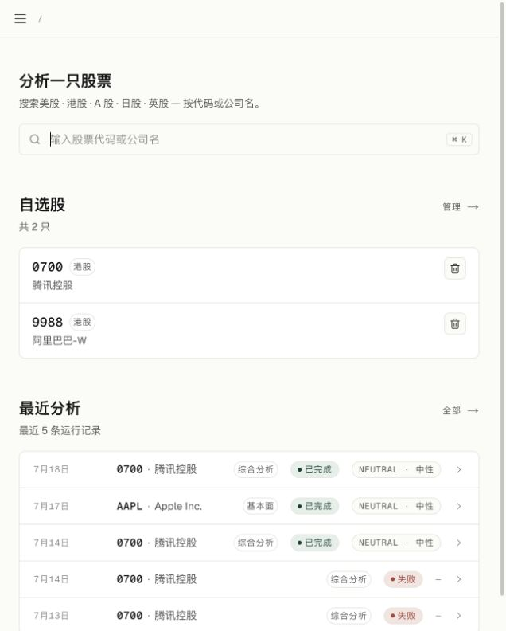
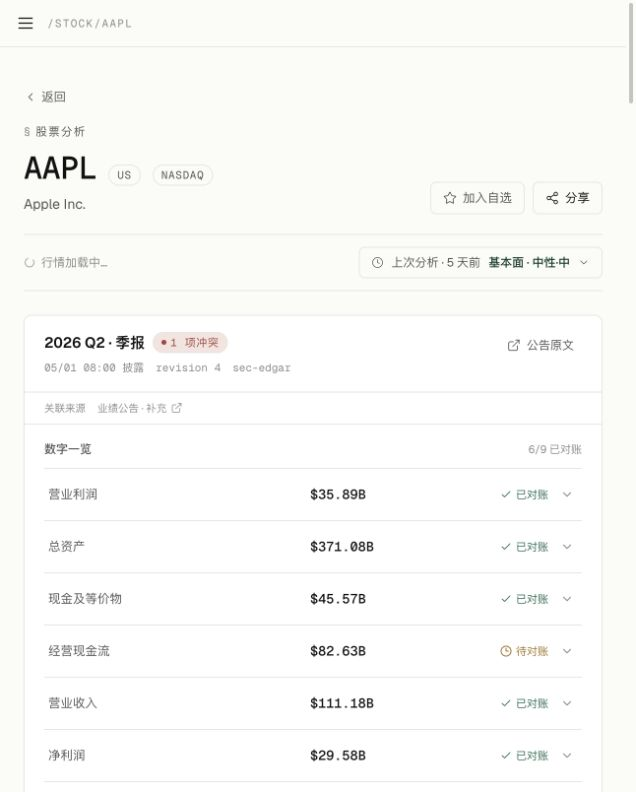

<div align="center">

# Bourse

### 面向严肃研究的 AI 股票工作台

把公告、财务数据和市场信息整理成**可追溯的研究结论**，而不是一段看似聪明、无法核对的聊天回答。

[](#license)
[](https://nextjs.org/)
[](https://nestjs.com/)
[](https://www.typescriptlang.org/)
[](#贡献)

[产品亮点](#产品亮点) · [界面预览](#界面预览) · [快速开始](#快速开始) · [工作原理](#工作原理) · [路线图](#路线图)

</div>

---

## 产品亮点

### 一只股票，一个研究入口

搜索股票代码或公司名，即可进入统一的研究工作台：查看综合分析、历史运行、自选股和财报速读。分析结果边生成边展示，失败的单个维度不会拖垮整份报告。

### 9 个维度的深度分析

综合分析覆盖基本面、估值、行业竞争、风险、技术面、情绪、情景、组合和治理。每个维度都有独立的结构化结果、结论和来源，适合从全局扫描到单点追问。

### 财报速读：从公告原文到可核对卡片

Bourse 会定期检测美股和 A 股公告，抓取不可变原文，解析章节，抽取逐指标事实，并进行自动一致性检查和结构化数据对账。卡片保留来源、版本和冲突状态：

- 数字带单位、币种、期间、合并范围和原文定位。
- 未通过检查的数字不展示，并标出省略数量。
- 8-K、10-Q 等材料可以作为同一财报事件的补充、替代或更正版本。
- 财报卡可直接追问，Chat 会绑定具体卡片版本回答。

当前财报速读支持 **美股 / A 股**；港股入口保留，但财报速读仍在 Phase 3。

### 代码负责事实，模型负责判断

财务比率、技术指标、同比和同行统计由 TypeScript 计算；模型负责解释、归纳和提出风险。所有可展示的结论都带有来源和抓取时间，便于复核。

---

## 界面预览

### 工作台首页

搜索入口、自选股和最近分析集中在同一页，适合反复查看和继续研究。



### 财报卡片

财报期间、对账状态、公告来源、关联材料和逐项数字在一个可扫描的卡片中呈现。



> 以上截图来自本地运行版本；数据内容取决于当前公告源、结构化数据和配置的 AI provider。

---

## 核心功能

| 功能 | 现在能做什么 |
| --- | --- |
| 综合分析 | 9 个维度、6 种投资大师视角、结构化结论和引用 |
| 财报速读 | US SEC / A 股公告发现、原文保存、解析、抽取、对账和版本历史 |
| 实时生成 | SSE 流式输出，显示阶段进度，支持断线续传和单维度重试 |
| Chat | 基于股票和财报卡片上下文追问，回答关联原文章节 |
| 自选股 | 添加、删除和管理股票，检测器按自选股并集工作 |
| 历史记录 | 查看过往分析、状态、信号和生成时间 |
| 主动触达 | 财报新卡、更新、更正可发送到 Webhook、飞书、Telegram 和 Daily Brief |
| Provider 配置 | Anthropic、OpenAI 及 OpenAI-compatible provider，可按用户配置 key |
| 部署模式 | 默认本地匿名模式；生产环境可开启 GitHub OAuth、JWT 和 CSRF |

### 分析流的用户体验

```text
创建分析 → section_start → report_chunk × N → report_complete
         → structured_data → section_complete → summary_chunk → done
```

每个 section 独立记录状态。某个维度失败时，其他维度仍然可以完成；用户可以只重试失败的 section。

### 财报速读的数据链路

```text
公告源轮询
  → 发现合格公告
  → 保存不可变原文（Filing）
  → 生成可重跑解析产物（FilingDerivation）
  → 抽取 MetricFact / Guidance / 管理层表述
  → 自动一致性检查
  → 与结构化数据逐指标对账
  → 生成 CardRevision
  → 页面、Chat、Daily Brief、Webhook
```

轮询默认每 5 分钟运行一次，使用 cursor、lease、advisory lock 和并发上限避免重复抓取。检测器当前只处理 US / A 股，Phase 1 页面打开时也支持懒生成。

---

## 可信度设计

| 常见问题 | Bourse 的处理 |
| --- | --- |
| 模型自己编财务数字 | 数字优先来自 connector 或结构化数据，模型只解释 |
| 单季和 YTD 混淆 | MetricFact 保存期间起止日、periodKind 和 accumulation |
| 公告版本覆盖历史 | 原文 insert-only，解析和卡片按版本保存 |
| 8-K / 10-Q 关系混乱 | Filing、EarningsEvent、CardRevision 分层，并记录 SUPPLEMENTS / CORRECTS / SUPERSEDES |
| 财报后的共识污染比较 | 只使用 `asOf < filingPublishedAt` 的冻结快照 |
| 错误数字仍然出现在卡片 | 引用定位、期间、币种、口径、YoY 和冲突检查不通过即剔除 |

自动一致性检查是概率性拦截，不是数学证明。产品不会承诺“100% 正确”，而是明确显示“已对账”“待对账”或“冲突”。

---

## 快速开始

### 本地体验：默认免登录

需要 Docker、Node.js 20+、pnpm 9+。

```bash
git clone https://github.com/crisweb1994/bourse.git
cd bourse
cp .env.example .env
# 在 .env 中至少配置一个 ANTHROPIC_API_KEY 或 OPENAI_API_KEY
docker compose --profile app up -d --build
```

打开 <http://localhost:3000>。默认 `AUTH_REQUIRED=false`，适合单人本地 review，不需要 GitHub OAuth。

### 开发模式

```bash
docker compose up -d                         # PostgreSQL :5434
pnpm install
pnpm db:generate && pnpm db:push
pnpm dev                                     # Web :3000 + API :3001
```

### 开启财报检测器

```dotenv
EARNINGS_DETECTION_ENABLED=true
EARNINGS_DETECTION_INTERVAL_MS=300000       # 默认 5 分钟
EARNINGS_DETECTION_BATCH_SIZE=50
EARNINGS_DETECTION_CONCURRENCY=5
```

财报速读还会受到公告源可用性、LLM 开关和每日预算影响。`EARNINGS_LLM_ENABLED=false` 时，系统会尝试结构化数据降级；期间不匹配则关闭生成，避免发布错误卡片。

### 多用户 / 生产部署

参考 [`.env.production.example`](.env.production.example) 配置 GitHub OAuth、JWT、CORS 和跨域 cookie。生产环境请固定镜像版本：

```bash
BOURSE_IMAGE=ghcr.io/crisweb1994/bourse:0.1.0 docker compose up -d
```

---

## 工作原理

```text
apps/web (Next.js 15)
  ├─ 工作台 / 自选股 / 历史 / Chat / 财报卡
  └─ SSE 渲染与 API client
             │ JWT cookie + CSRF
apps/api (NestJS)
  ├─ Auth / Analysis orchestration / Earnings scheduler
  ├─ SSE / Chat / Notification delivery
  └─ Prisma + PostgreSQL
             │
packages/analysis
  ├─ SEC EDGAR / Yahoo / 巨潮 / 东方财富 connectors
  ├─ snapshot / deterministic compute / earnings verify
  └─ prompts / schemas / source provenance
```

### 关键不变式

1. **代码计算，LLM 判断**：客观数字由代码或结构化来源提供。
2. **原文不可变**：公告原文按来源 ID 和内容哈希保存。
3. **解析可重跑**：parserVersion、modelVersion 和 schemaVersion 进入产物和卡片版本。
4. **来源可定位**：每个可展示事实必须能回到公告章节、页码或字符范围。
5. **失败关闭**：无法定位或无法对账的数字不悄悄展示。
6. **请求幂等**：重复点击或并发请求会收敛到同一生成 run。

---

## 技术栈

| 层 | 技术 |
| --- | --- |
| Frontend | Next.js 15 · React 19 · Tailwind CSS v4 · lucide-react · react-markdown |
| Backend | NestJS · Passport · JWT httpOnly cookie · Prisma · class-validator |
| Database | PostgreSQL 16，Docker 默认端口 5434 |
| AI | Anthropic SDK · OpenAI SDK · OpenAI-compatible providers |
| Data | SEC EDGAR · Yahoo Finance · 巨潮 · 东方财富 · akshare 镜像 |
| Monorepo | Turborepo · pnpm workspaces · TypeScript |

---

## 项目结构

```text
stock-suggest/
├── apps/
│   ├── api/                NestJS API、认证、分析、财报和通知
│   └── web/                Next.js 工作台、Chat、财报卡片
├── packages/
│   ├── analysis/           connectors、compute、prompts、验证和工作流
│   ├── shared-types/       跨包类型和枚举
│   └── tsconfig/           共享 TypeScript 配置
├── docs/
│   └── screenshots/        README 产品截图
└── docker-compose.yml
```

---

## 当前状态与路线图

### 已落地

- [x] 9 维度综合分析和投资大师 persona
- [x] A 股 / 美股 / 港股股票研究入口
- [x] SSE 流式输出、断线续传和 section 重试
- [x] 用户级 AI provider 和 Web Search adapter
- [x] US / A 股财报公告检测与财报卡片
- [x] MetricFact 一致性检查、结构化对账和版本历史
- [x] Chat 财报追问、Daily Brief 和签名 Webhook
- [x] 本地匿名模式与 GitHub OAuth 生产模式

### 计划中

- [ ] 财报速读港股支持（Phase 3）
- [ ] 多语言 UI（英文 / 日文）
- [ ] 移动端适配
- [ ] 自定义分析维度和 persona 编辑器
- [ ] 自托管 LLM 评估与运营监控面板

当前功能测试已覆盖真实 SEC / A 股公告、原文解析、财报卡、Chat、通知、预算降级、重启恢复和并发幂等；生产发布仍需更多样本证明检测器的 p90 SLA 和容量表现。

---

## 贡献

欢迎提交 issue、PR 和 RFC。特别欢迎：

- 新 connector 和公告源
- 新投资大师 persona
- 可由代码确定性计算的新指标
- prompt 优化和 eval 用例
- 财报速读的港股适配

## License

MIT.

<div align="center">

如果 Bourse 对你的研究流程有帮助，欢迎 Star。

</div>
