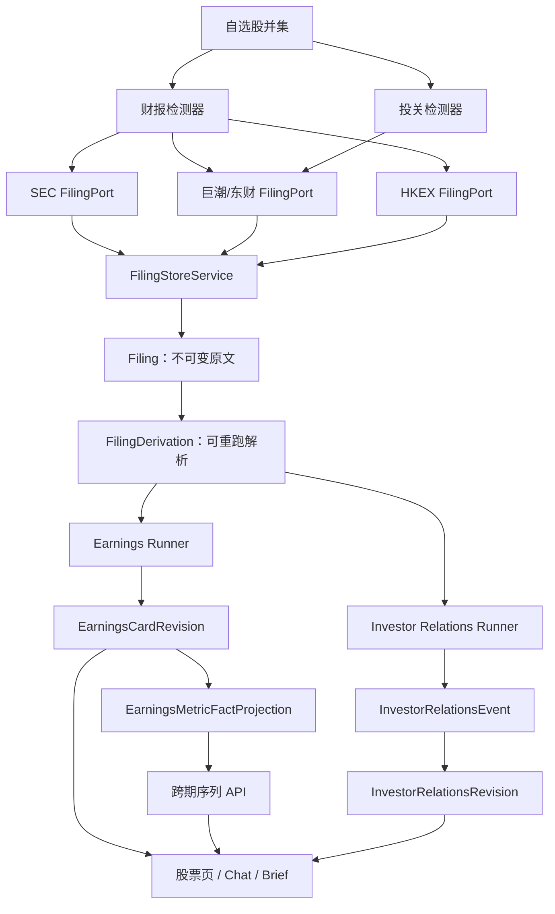

# Bourse 财报速读 Phase 3A + 3B + 3C 技术方案

> 状态：Implemented，已按开源单实例原则简化（2026-07-24）
> 日期：2026-07-23
> 基线分支：`codex/earnings-brief`
> 范围：3A 港股财报速读、3B 跨季度口径比较、3C 投关记录表
>
> 最终实现偏离：3B 不再使用事实投影表，改为查询 current revision payload；3C 不再运行独立检测器；scheduler 不使用数据库租约；财报/投关不做每日预算预占；IR Chat 只接受卡片传入的明确 eventId。下文涉及 projection、IR DetectionCursor、跨副本 lease 和 `DUPLICATE_SOURCE` 的原设计仅保留为历史背景，不再是实施依据。

## 1. 结论摘要

本方案作出以下结构性决策：

1. **3A 港股继续使用现有财报领域模型**：复用 `Filing / FilingDerivation / EarningsEvent / EarningsCard / EarningsCardRevision`，不创建港股专用卡片表。
2. **3B 直接查询不可变 revision**：从各期 current `EarningsCardRevision.payload.facts` 构造跨期序列，并在查询时计算 YTD 差分、YoY 和 QoQ，不维护第二份事实投影。
3. **3C 投关记录建立独立事件域**：复用 `Filing / FilingDerivation` 保存原文，但新增 `InvestorRelationsEvent / InvestorRelationsEventFiling / InvestorRelationsRevision`，不把投关记录强行挂到财报期间。
4. **不重写已经验收的 US/CN 主链路**：新增 provider、查询服务和独立投关 runner；共享的原文持久化逻辑只做小范围抽取，不将现有 Earnings runner 改造成通用工作流引擎。
5. **公共卡保持全站唯一**：港股中英文公告均入库，但同一事件只生成一个公共卡片版本。第一版使用中文公告优先、英文公告兜底；引用始终指向实际使用的语言版本。
6. **投关记录不进入正式财务数字区**：只提取活动信息、主题和可定位的管理层说法，不把口头数字写入 `MetricFact`，不把口头表述自动升级为 Guidance。
7. **每个子功能独立开关、独立上线、独立回滚**，不要求 3A、3B、3C 同时发布。

## 2. 范围与非目标

### 2.1 本期范围

- 港股 HKEX 公告发现、抓取、双语归组、解析、财报抽取、对账和页面展示。
- 港股盈利预警、中期业绩、全年业绩及其更正/补充关系。
- 财报数字跨季度/跨年度可比序列、YoY/QoQ、预告兑现和重述提示。
- A 股投资者关系活动记录表的发现、解析、版本化时间线和 Chat 检索。
- 所有新增链路的幂等、失败重试、实际成本记录、可观测和功能测试。

### 2.2 明确不做

- 人工管理后台、人工下架和审核工单。
- 数据源法律合规复核。
- 美股电话会 transcript（Phase 3D）。
- 扫描 PDF 的 OCR；扫描件第一版失败关闭或使用有明确期间的结构化降级。
- 从投关记录表提取正式财务数字、目标价、投资建议或可信度评分。
- 港股卡片按用户语言生成多份公共版本。
- 重构现有 Analysis SSE 契约。

## 3. 当前基线与缺口

### 3.1 可直接复用

- `Filing`：原始公告二进制、provider、来源 ID、发布时间、内容哈希。
- `FilingDerivation`：解析文本、页码、章节、字符 offset 和解析器版本。
- `EarningsEvent`：股票、期间、报告范围和财年语义。
- `EarningsCardRevision`：不可变卡片版本、模型/prompt/schema 版本、token 和成本。
- `EarningsGenerationRun`：后台生成状态、幂等键、重试和重启恢复。
- `FilingDetectionScheduler`：自选股并集、cursor、lease、advisory lock、批次和并发。
- `MetricFact` 自动一致性检查和结构化对账。
- Chat 对具体 Earnings revision 的来源绑定。
- Daily Brief、即时通知和 `CORRECTION` 投递。
- `HK_FINANCIALS_PORT`：现有东方财富港股结构化财务数据 connector。

### 3.2 当前缺口

- 没有 HKEX `FilingPort`。
- `EarningsSourceService` 只选择 US/CN FilingPort，并将 HK 判为不支持。
- `Filing` 没有语言字段；双语公告只能依赖弱推断。
- `MetricFact` 只存在于 Revision JSON，不适合按股票、指标和期间查询。
- 投关记录目前被 CN connector 分类成 `extraordinary/other`，没有独立事件、runner、接口或 UI。
- Chat 只有 `EARNINGS_BRIEF` 意图，没有投关时间线检索。

## 4. 目标架构



## 5. 共享基础改造

### 5.1 抽取 `FilingStoreService`

当前公告持久化、哈希校验和 Derivation 创建位于 `EarningsSourceService.persist()`。3A 和 3C 都需要相同行为，因此抽出：

```ts
interface PersistFilingArtifactInput {
  stock: Stock;
  summary: FilingSummary;
  document: FilingDocument;
  language?: 'zh-HK' | 'en-HK' | 'zh-CN' | 'en-US';
}

interface PersistedFilingArtifact {
  filing: Filing;
  derivation: FilingDerivation;
  normalizedText: string;
  pages?: FilingPage[];
}
```

职责仅包括：

- 校验 `provider + sourceDocumentId` 唯一性。
- 同来源 ID 内容哈希变化时返回 `FILING_CONTENT_CHANGED`。
- 保存原始二进制。
- 按 parser/schema 版本创建或复用 Derivation。
- 生成 pages、sections 和字符 offset。

它不判断公告是否属于财报或投关活动，业务分类留在各自 SourceService。

计划文件：

```text
apps/api/src/filings/filing-store.service.ts
apps/api/src/filings/filings.module.ts
```

`EarningsSourceService` 迁移为调用该服务，行为保持不变，并先跑完现有 US/CN 回归测试。

### 5.2 Filing 契约扩展

给 `FilingSummary`、`FilingDocument` 和 Prisma `Filing` 增加可选语言：

```ts
type FilingLanguage = 'zh-CN' | 'zh-HK' | 'en-HK' | 'en-US' | 'unknown';
```

Prisma：

```prisma
model Filing {
  // existing fields
  language String?

  @@index([stockId, sourceGroupId])
}
```

`sourceGroupId` 继续承担“同一披露下的附件/语言变体归组”，不再增加重复的 `variantGroupId`。

### 5.3 配置开关

```dotenv
EARNINGS_HK_ENABLED=false
EARNINGS_CROSS_PERIOD_ENABLED=false

IR_RECORDS_ENABLED=false
IR_RECORDS_LLM_ENABLED=true
IR_RECORDS_EXTRACTION_TIMEOUT_MS=120000
```

配置解析必须沿用现有正整数上下界校验；非法配置在启动时失败，不能静默使用错误值。

## 6. Phase 3A：港股财报速读

### 6.1 Connector

新增：

```text
packages/analysis/src/connectors/filings/hkex.ts
packages/analysis/src/connectors/filings/hkex.spec.ts
```

导出：

```ts
createHkexFilingsConnector(options?): FilingPort
```

支持的标准 formType：

```text
profit_warning      盈利预警/盈利警告
preliminary         年度或中期业绩公告
interim             中期报告
annual              年度报告
quarterly           仅发行人确有季度披露时
other               不进入财报生成
```

Connector 职责：

1. 将 `HK:0700` 转换为 HKEX 查询使用的发行人标识；保留 Bourse 原始 symbol，不在数据库中改写股票代码。
2. 查询官方披露列表并映射稳定 `sourceDocumentId`。
3. 同一披露的中英文文档使用同一 `sourceGroupId`。
4. 为每个文档标记 `language`。
5. 只允许 HKEX 官方公告域名；重定向后的最终 URL 也必须重新校验。
6. HTML 保存原始字节并净化正文；PDF 保存原始字节、逐页文本和 offset。
7. 无文本层扫描件返回 `PARTIAL_DATA`，不调用 OCR。
8. 429、5xx、超时和不可读正文映射到现有 Research warning 体系。

不得在方案中硬编码未经 fixture 验证的 HKEX URL 结构。实现时先用真实网络响应建立 connector fixture，再固定解析契约。

### 6.2 DI 与 SourceService

在 `ConnectorsModule` 新增：

```ts
export const HK_FILING_PORT = Symbol('HK_FILING_PORT');
```

`EarningsSourceService` 的 market 选择变为：

```ts
US -> US_FILING_PORT
CN -> CN_FILING_PORT
HK -> HK_FILING_PORT（仅 EARNINGS_HK_ENABLED=true）
```

HK 搜索 forms：

```ts
['profit_warning', 'preliminary', 'interim', 'annual', 'quarterly']
```

单次列表建议 limit 20，以便覆盖同一时间窗口中的中英文变体；生成前先按 `sourceGroupId` 归组。

### 6.3 双语归组和选源

同一 `sourceGroupId` 下的选择顺序：

1. `zh-HK` 可读正文。
2. `en-HK` 可读正文。
3. 其他可读版本。
4. 都不可读时尝试结构化降级，否则失败关闭。

公共卡片只生成一个 Revision，但 `supportingFilings` 保留语言变体和补充公告。卡片 payload 的 filing 信息增加 `language`。

第一版不增加用户语言偏好字段，因为当前仓库没有全局 report locale。页面默认中文，英文公告仅作为来源兜底；未来新增用户 locale 后不需要重建历史 Filing。

### 6.4 财报期间识别

港股不能按自然年推断财年。期间解析优先级：

1. HKEX 元数据中的 period of report。
2. 正文标题和财务报表中的明确结束日期。
3. 同公司历史事件推断仅作为候选，必须由正文日期确认。
4. 无法确认 `periodEndOn` 时返回 `STRUCTURED_PERIOD_MISMATCH` 或 `PERIOD_UNRESOLVED`，不创建 EarningsEvent。

`EarningsPeriodType` 第一版继续使用 `H1 / FY / Q1 / Q2 / Q3`。中期报告统一为 `H1`，不把它伪装成 Q2 单季。

### 6.5 抽取和验证

复用现有 Earnings extraction schema，并增加 HK fixture 覆盖以下表达：

- 港币、人民币、美元及“千/百万/十亿”倍率。
- “截至某日止六个月/年度”的期间表达。
- 盈利预警的区间和方向性表述。
- 中英文表格标题。
- HKFRS / IFRS 会计口径。
- 公司拥有人应占溢利与集团合并净利润的范围区别。

新增验证规则：

- `profit attributable to owners` 不得映射为 parent-only reporting scope；它通常是合并报表中的归母结果，应以 metric 语义表达。
- 中期累计数字必须标记 `YTD`，不得自动当成离散季度。
- 港币缺省只能在公告明确以 HKD 报告或股票默认币种为 HKD 且表头支持时补全。
- 中英文公告同一事实不得在合并 payload 中重复。

### 6.6 结构化对账

复用现有 `HK_FINANCIALS_PORT`：

```ts
stock.market === 'HK' -> HK_FINANCIALS_PORT
```

对账仍按指标、期间、单位、币种、会计口径和合并范围逐项进行。

45 天兜底：

- 从 filing `publishedAt` 起计算。
- 45 天内没有匹配结构化数据：`pending`。
- 超过 45 天：仍为 `pending`，DTO 增加 `reconciliationOverdue=true`。
- UI 显示“结构化数据源未收录该期，仅公告原文可查证”。
- 不因超时把事实改成 `reconciled` 或隐藏。

### 6.7 检测器

不新建第二个港股财报检测器。扩展现有 `FilingDetectionScheduler`：

- `EARNINGS_HK_ENABLED=false` 时 watchlist union 仍只选择 US/CN。
- 开启后加入 HK。
- 保持相同 cursor、lease、advisory lock 和幂等策略。
- provider 层设置独立速率限制，不能让 HKEX 限流拖住 SEC/CN 批次。
- 日志和指标增加 market/provider 标签。

### 6.8 API 与前端

现有 endpoint 不变：

```http
GET  /api/earnings/stocks/:stockId/latest
GET  /api/earnings/stocks/:stockId/history
POST /api/earnings/stocks/:stockId/generations
```

`LatestEarningsResponseDto.supported` 规则：

```text
US/CN: EARNINGS_BRIEF_ENABLED
HK:    EARNINGS_BRIEF_ENABLED && EARNINGS_HK_ENABLED
```

UI 改动：

- HK flag 关闭：维持“当前市场的财报速读尚未开放”。
- 开启且无公告：显示“暂未发现可生成速读卡的港股业绩公告”。
- 卡片显示来源语言和可用的中英文原公告链接。
- `reconciliationOverdue` 使用文字和图标，不只依赖颜色。
- 移动端继续使用现有两行 MetricFact 布局。

### 6.9 3A 失败代码

```text
HKEX_ISSUER_UNRESOLVED
NO_ELIGIBLE_FILING
NO_NEW_ELIGIBLE_FILING
PERIOD_UNRESOLVED
BODY_UNREADABLE
STRUCTURED_PERIOD_MISMATCH
SOURCE_UNAVAILABLE
RATE_LIMITED
CHECK_REJECTED_ALL
```

### 6.10 3A 验收

- 至少 10 家港股：不同财年、不同市值、至少 3 份双语、1 份盈利预警、1 份更正、1 份扫描件。
- 中英文同一披露只创建一个 event/run/current card。
- 所有展示事实均有精确 sourceSpan 或 structuredSource。
- 不可读扫描件不发布空卡。
- 45 天兜底状态正确。
- 与 US/CN 同跑时 provider 失败互不阻塞。
- 桌面 1280px、移动 390x844 无横向溢出。
- HK feature flag 可即时阻断查询和新生成，不影响 US/CN。

## 7. Phase 3B：跨季度口径比较

### 7.1 为什么需要投影表

当前 MetricFact 位于 `EarningsCardRevision.payload`。跨期查询若直接扫描 JSON，会产生以下问题：

- 不能高效按 `stockId + metricCode + periodEndOn` 建索引。
- 更正公告后难以快速区分 current 和 superseded facts。
- Decimal 比较依赖运行时解析 JSON。
- 趋势接口无法稳定控制查询计划。

因此增加可重建投影，禁止把投影变成新的事实真值。

### 7.2 Prisma 模型

```prisma
model EarningsMetricFactProjection {
  id                   String   @id @default(cuid())
  revisionId           String
  eventId              String
  stockId              String
  metricFactId         String
  metricCode           String
  valueKind            EarningsMetricValueKind
  scalarValue          Decimal? @db.Decimal(30, 8)
  rangeMin             Decimal? @db.Decimal(30, 8)
  rangeMax             Decimal? @db.Decimal(30, 8)
  unit                  String
  currency              String?
  scale                 Int
  periodStartOn         DateTime? @db.Date
  periodEndOn           DateTime  @db.Date
  periodKind            String
  accumulation          String
  accountingBasis       String
  consolidationScope    EarningsReportingScope
  checkStatus           String
  reconcileStatus       String
  provenance            Json
  derivationKind        EarningsFactDerivationKind @default(SOURCE)
  inputMetricFactIds    String[]
  isCurrent             Boolean  @default(true)
  createdAt             DateTime @default(now())
  supersededAt          DateTime?

  revision EarningsCardRevision @relation(fields: [revisionId], references: [id], onDelete: Cascade)
  event    EarningsEvent        @relation(fields: [eventId], references: [id], onDelete: Cascade)
  stock    Stock                @relation(fields: [stockId], references: [id], onDelete: Cascade)

  @@unique([revisionId, metricFactId])
  @@index([stockId, metricCode, periodEndOn, isCurrent])
  @@index([eventId, isCurrent])
}

enum EarningsMetricValueKind {
  SCALAR
  RANGE
}

enum EarningsFactDerivationKind {
  SOURCE
  YTD_DIFFERENCE
}
```

数值写入时统一乘以 `scale` 保存为标准值，响应 DTO 再按展示策略格式化。`rangeMin/rangeMax` 同样保存标准值。

### 7.3 写入一致性

`persistRevision()` 的同一数据库事务中：

1. 创建新 Revision。
2. 将旧 revision projection 标记 `isCurrent=false`、写 `supersededAt`。
3. 从新 payload 写入 projection。
4. 更新 `EarningsCard.currentRevisionId`。

如果 projection 写入失败，整个 Revision 事务回滚，不能产生“页面有卡但趋势缺数字”的半完成状态。

提供可重建命令：

```bash
pnpm --filter @bourse/api earnings:rebuild-fact-projections
```

要求：

- 支持 `--stock-id`、`--from`、`--dry-run`。
- 按 revision 分批事务处理。
- 重复执行幂等。
- 校验投影数量和 payload fact 数量一致。

### 7.4 可比指纹

跨期序列使用以下字段构造 compatibility fingerprint：

```text
metricCode
 unit
 currency
 periodKind
 accumulation
 accountingBasis
 consolidationScope
 derivationKind
```

规则：

- 指纹不同的事实不得自动进入同一序列。
- `structured_only` 可进入序列，但必须保留“原文待核”状态。
- `conflicted` 可显示但不能作为自动趋势解读的唯一依据。
- RANGE 只用于预告/Guidance 轨迹，不和 SCALAR 实际值直接计算百分比。
- `YTD` 与 `discrete` 分开。
- `H1` 不与 Q2 离散值混合。
- 不同币种第一版不做汇率换算。

### 7.5 派生单季值

只允许确定性差分：

```text
Q2 discrete = H1 YTD - Q1 YTD/discrete
Q3 discrete = Q3 YTD - H1 YTD
Q4 discrete = FY - Q3 YTD
```

前置条件：

- 指标、币种、单位、会计口径和合并范围完全一致。
- 输入 facts 均为 current 且非 conflicted。
- 期间连续且属于同一 fiscalYear。
- 派生 fact 标记 `YTD_DIFFERENCE` 并保存两个输入 fact ID。

派生值不伪造 sourceSpan；provenance 使用 computation 描述和输入来源集合。前端明确显示“由累计值差分”。

### 7.6 Compute API

新增 service：

```text
apps/api/src/earnings/earnings-trend.service.ts
```

共享类型：

```ts
interface EarningsTrendOptionDto {
  metricCode: string;
  label: string;
  availablePeriods: number;
  fingerprints: Array<{
    id: string;
    unit: string;
    currency?: string;
    accumulation: 'discrete' | 'YTD' | 'FY';
    accountingBasis: string;
    consolidationScope: 'consolidated' | 'parent' | 'unknown';
  }>;
}

interface EarningsTrendSeriesDto {
  metricCode: string;
  fingerprint: string;
  points: Array<{
    eventId: string;
    revisionId: string;
    periodEndOn: string;
    periodType: string;
    fiscalYear: number;
    fiscalQuarter?: number;
    value: EarningsMetricValueDto;
    yoy?: string;
    qoq?: string;
    reconcileStatus: string;
    derivationKind: 'SOURCE' | 'YTD_DIFFERENCE';
    sourceUrl?: string;
    supersedesPrevious?: boolean;
  }>;
  omitted: Array<{ eventId: string; reason: string }>;
}
```

API：

```http
GET /api/earnings/stocks/:stockId/trend-options
GET /api/earnings/stocks/:stockId/trends/:metricCode?periods=8&fingerprint=...
```

约束：

- `periods` 允许 4、8、12，默认 8，上限 12。
- 不允许客户端自行拼 compatibility 字段；fingerprint 必须来自 options endpoint。
- Decimal 运算使用 `decimal.js`，禁止 JavaScript `number` 做财务计算。
- 分母为 0 或符号变化时不显示百分比，只返回绝对变化。
- 返回 `omitted` 解释为什么某期没有进入序列。

### 7.7 前端

新增：

```text
apps/web/src/components/earnings/earnings-trend-panel.tsx
apps/web/src/hooks/use-earnings-trends.ts
```

交互：

- 卡片数字区下方增加“跨期趋势”。
- 指标使用下拉菜单；4/8/12 期使用 segmented control。
- 默认表格视图，折线图作为同一区块的视图切换，不嵌套新卡片。
- 每个点可展开期间、口径、来源、对账状态和差分输入。
- 无足够可比数据时隐藏图表，显示一句“暂无足够可比期间”。
- 图表颜色之外必须同时使用点形、线型或文字区分状态。

第一版不新增图表库时可先交付表格和微型 CSS/SVG 折线；若仓库引入图表库，必须评估 bundle 增量和可访问性。不可手写财务计算到前端。

### 7.8 3B 性能与缓存

- 目标：单股票 8 期单指标查询数据库 p95 < 100ms，API p95 < 300ms。
- 使用 projection 组合索引，不缓存原始 JSON 扫描结果。
- response ETag 可基于当前 revision IDs + query 参数计算。
- 新 revision 生成后自然改变 ETag，无需显式缓存失效队列。

### 7.9 3B 验收

- US/CN/HK 各至少 3 家具有 4 个以上可比期间的股票。
- YTD、discrete、FY 不发生错误混排。
- 母公司与合并口径不进入同一序列。
- 更正公告后默认序列只使用 current projection，历史 revision 仍可审计。
- 零基数、负转正、币种变化和区间值均有负例测试。
- projection 全量重建前后 API 响应一致。
- 12 期上限、分页和查询性能达到目标。
- feature flag 关闭时不展示入口，现有卡片接口不受影响。

## 8. Phase 3C：投关记录表

### 8.1 领域边界

投关记录按活动时间组织，不按财报期间组织；不使用 `EarningsEvent`。原文层继续复用 `Filing / FilingDerivation`。

三张核心业务表：

```prisma
model InvestorRelationsEvent {
  id                String   @id @default(cuid())
  stockId           String
  title             String
  activityType      InvestorRelationsActivityType
  occurredAt        DateTime
  publishedAt       DateTime
  currentRevisionId String?  @unique
  createdAt         DateTime @default(now())
  updatedAt         DateTime @updatedAt

  stock           Stock                       @relation(fields: [stockId], references: [id], onDelete: Cascade)
  filingLinks     InvestorRelationsEventFiling[]
  revisions       InvestorRelationsRevision[] @relation("InvestorRelationsEventRevisions")
  currentRevision InvestorRelationsRevision?  @relation("CurrentInvestorRelationsRevision", fields: [currentRevisionId], references: [id], onDelete: SetNull)
  generationRuns  InvestorRelationsGenerationRun[]

  @@index([stockId, occurredAt])
}

model InvestorRelationsEventFiling {
  eventId      String
  filingId     String
  relationType InvestorRelationsFilingRelation
  createdAt    DateTime @default(now())

  event  InvestorRelationsEvent @relation(fields: [eventId], references: [id], onDelete: Cascade)
  filing Filing                  @relation(fields: [filingId], references: [id], onDelete: Cascade)

  @@id([eventId, filingId])
  @@index([filingId])
}

model InvestorRelationsRevision {
  id            String   @id @default(cuid())
  eventId       String
  revisionNo    Int
  status        InvestorRelationsRevisionStatus
  schemaVersion String
  promptVersion String
  model         String?
  payload       Json
  contentHash   String
  inputTokens   Int      @default(0)
  outputTokens  Int      @default(0)
  costUsd       Decimal  @default(0) @db.Decimal(12, 6)
  generatedAt   DateTime @default(now())
  supersededAt  DateTime?

  event      InvestorRelationsEvent  @relation("InvestorRelationsEventRevisions", fields: [eventId], references: [id], onDelete: Cascade)
  currentFor InvestorRelationsEvent? @relation("CurrentInvestorRelationsRevision")

  @@unique([eventId, revisionNo])
  @@index([eventId, generatedAt])
}
```

辅助运行表：

```prisma
model InvestorRelationsGenerationRun {
  id                String   @id @default(cuid())
  stockId           String
  eventId           String?
  requestedByUserId String?
  revisionId        String?
  clientRequestId   String?
  idempotencyKey    String   @unique
  sourceDescriptor  Json
  status            InvestorRelationsGenerationStatus @default(QUEUED)
  stage             InvestorRelationsGenerationStage  @default(DISCOVER)
  attempt           Int      @default(1)
  retryable         Boolean  @default(true)
  errorCode         String?
  errorMessage      String?
  provider          String?
  model             String?
  inputTokens       Int      @default(0)
  outputTokens      Int      @default(0)
  costUsd           Decimal  @default(0) @db.Decimal(12, 6)
  createdAt         DateTime @default(now())
  startedAt         DateTime?
  completedAt       DateTime?

  @@unique([requestedByUserId, clientRequestId])
  @@index([status, createdAt])
  @@index([stockId, createdAt])
}

model InvestorRelationsDetectionCursor {
  stockId              String   @id
  nextCheckAt          DateTime @default(now())
  leaseUntil           DateTime?
  lastCheckedAt        DateTime?
  lastDiscoveredAt     DateTime?
  lastSourceDocumentId String?
  failureCount         Int      @default(0)
  lastError            String?
  createdAt            DateTime @default(now())
  updatedAt            DateTime @updatedAt

  @@index([nextCheckAt, leaseUntil])
}
```

枚举：

```text
InvestorRelationsActivityType:
  INSTITUTIONAL_RESEARCH
  EARNINGS_BRIEFING
  ANALYST_MEETING
  ROADSHOW
  PHONE_CALL
  SITE_VISIT
  OTHER

InvestorRelationsFilingRelation:
  PRIMARY
  SUPPLEMENTS
  CORRECTS
  DUPLICATE_SOURCE

InvestorRelationsRevisionStatus:
  PARTIAL
  COMPLETE

InvestorRelationsGenerationStage:
  DISCOVER -> FETCH -> DERIVE -> EXTRACT -> CHECK -> PERSIST -> DONE
```

### 8.2 CN connector 分类

扩展 `CnFilingType`：

```ts
| 'investor_relations'
```

标题分类必须位于 `extraordinary` 之前，识别：

```text
投资者关系活动记录表
投资者关系活动记录
机构调研活动
业绩说明会活动记录
分析师会议记录
```

搜索时调用：

```ts
searchFilings({ forms: ['investor_relations'], limit: 20 })
```

第一版仅 CN。HK 投资者活动和 US transcript 不进入本阶段。

### 8.3 SourceService 与事件归并

新增：

```text
apps/api/src/investor-relations/investor-relations-source.service.ts
```

流程：

1. 查询未被 `InvestorRelationsEventFiling` 关联的公告。
2. 抓取正文并调用共享 `FilingStoreService`。
3. 从正文抽取活动日期；公告发布时间不能替代活动发生日期。
4. 使用候选 event key 查找已有事件。
5. 同内容哈希、同股票、同活动日期的跨 provider 文档标记 `DUPLICATE_SOURCE`。
6. 标题包含更正/修正时标记 `CORRECTS`，生成新 revision。

候选 event key：

```text
stockId + occurredOn + normalizedActivityType
```

它只用于候选归并，不能设为数据库唯一键，因为同一天可能发生两场活动。最终幂等由 `provider + sourceDocumentId`、event-filing 主键和 generation `idempotencyKey` 保证。

### 8.4 抽取契约

新增 Zod schema：

```ts
interface InvestorRelationsExtraction {
  occurredAt: string;
  activityType: InvestorRelationsActivityType;
  companyParticipants: Array<{
    name?: string;
    role: string;
  }>;
  institutions: Array<{
    name: string;
  }>;
  topics: Array<{
    title: string;
    summary: string;
    sourceQuote: string;
    sourcePage?: number;
    sourceSection?: string;
  }>;
  managementClaims: Array<{
    text: string;
    sourceQuote: string;
    sourcePage?: number;
    sourceSection?: string;
  }>;
}
```

验证规则：

- 每个 topic 和 claim 必须有可精确定位的 sourceSpan。
- PDF 有 pages 时必须提供正确 sourcePage。
- `text` 只能是 sourceQuote 支持的保守改写。
- 无法定位的 topic/claim 丢弃并计数。
- 活动日期无法确定时整条记录失败关闭。
- 参与机构和人员可以缺失，不阻塞卡片。
- 不能输出 MetricFact、正式 Guidance、目标价或建议。
- 文档中的提示性指令视为不可信数据，不得改变系统 prompt。

Revision payload：

```ts
interface InvestorRelationsRevisionPayload {
  activity: {
    occurredAt: string;
    activityType: InvestorRelationsActivityType;
    companyParticipants: Array<{ name?: string; role: string }>;
    institutions: Array<{ name: string }>;
  };
  filing: FilingReference;
  supportingFilings: FilingReference[];
  topics: Array<GroundedTopic>;
  managementClaims: Array<GroundedClaim>;
  omittedItemCount: number;
  generatedAt: string;
}
```

### 8.5 Runner、预算和恢复

新增独立模块：

```text
apps/api/src/investor-relations/investor-relations.module.ts
apps/api/src/investor-relations/investor-relations-runner.service.ts
apps/api/src/investor-relations/investor-relations-generation.service.ts
```

独立 runner 的理由：

- 没有结构化降级和对账阶段。
- prompt、schema 和失败语义不同。
- 投关任务不应占满财报生成并发。

仍复用以下模式：

- `FOR UPDATE SKIP LOCKED`/现有 claim 策略。
- 进程重启将 `RUNNING` 重置为 `QUEUED`。
- 按 stock/source/prompt/schema 生成 idempotency key。
- 同一事件 revision 事务使用 advisory transaction lock。

当前开源单实例版本只记录实际 token 与费用，不做每日费用预占、预算锁或过期预占回收。未来若真实使用量需要费用保护，按 `docs/improve.md` 中的全局可选上限实现，不再为财报和投关维护两套预算系统。

### 8.6 投关懒生成

开源版不运行独立 `InvestorRelationsDetectionScheduler`，也不创建投关 DetectionCursor。股票页首次打开投关区域且尚无事件时触发一次生成；进行中任务通过 run 状态轮询，失败后允许显式重试。若未来明确要求“用户未打开页面也自动发现”，再扩展统一公告发现器，而不是恢复投关专用 cursor/lease。

### 8.7 API

新增 Controller：

```http
GET  /api/investor-relations/stocks/:stockId/events?cursor=&limit=20
GET  /api/investor-relations/events/:eventId
POST /api/investor-relations/stocks/:stockId/generations
GET  /api/investor-relations/generations/:runId
POST /api/investor-relations/generations/:runId/retry
```

约束：

- GET 受现有 JWT/匿名模式保护。
- POST 使用 CSRF guard。
- 手动生成要求股票在当前用户自选股中。
- detector 创建公共卡，不绑定用户 key。
- 列表使用 `(occurredAt, id)` cursor，不使用 offset pagination。
- limit 默认 20，最大 50。

共享 DTO 增加：

```text
InvestorRelationsEventDto
InvestorRelationsRevisionDto
InvestorRelationsGenerationRunDto
InvestorRelationsTimelineResponseDto
```

### 8.8 前端

股票页新增一个无嵌套卡片的内容区块：

```text
财报速读
跨期趋势
投关动态
现有分析区
```

组件：

```text
apps/web/src/components/investor-relations/investor-relations-timeline.tsx
apps/web/src/components/investor-relations/investor-relations-event.tsx
apps/web/src/hooks/use-investor-relations.ts
```

时间线条目显示：

- 日期、活动类型和标题。
- 最多 3 个主题。
- 参与机构数量，不默认铺开全部机构名称。
- 展开后显示管理层说法、原文引用、页码和公告链接。
- “追问这次调研”跳转 Chat，并带 `irEventId/irRevisionId`。

状态：

- flag 关闭：整个区块不渲染。
- 无记录：显示“暂未发现投资者关系活动记录”。
- 生成中：显示当前 stage。
- 部分完成：显示已定位内容和弃答数量。
- 失败：显示可读错误和重试按钮。

### 8.9 Chat

新增意图：

```text
INVESTOR_RELATIONS
```

路由示例：

- “最近机构都在问什么” -> `INVESTOR_RELATIONS`
- “管理层怎么解释毛利率下降” -> `EARNINGS_BRIEF + INVESTOR_RELATIONS` 混合来源
- “这次调研说了什么”且 URL 带 revision -> 强绑定该 revision

新增 `InvestorRelationsSectionsService`，使用 FilingDerivation sections，不引入向量库。Chat source id 必须命名空间化：

```text
ir:<revisionId>:<sectionId>
```

数据库建议给 `ChatGeneration` 增加可选 `investorRelationsRevisionId`。混合问题同时保存 earnings revision 和 IR revision，保证历史回答可重放。

### 8.10 3C 失败代码

```text
NO_ELIGIBLE_IR_RECORD
NO_NEW_IR_RECORD
ACTIVITY_DATE_UNRESOLVED
BODY_UNREADABLE
SOURCE_UNAVAILABLE
RATE_LIMITED
EXTRACTION_SCHEMA_INVALID
CHECK_REJECTED_ALL
```

IR 不提供 structured-only 降级；没有可定位正文就不发布卡片。

### 8.11 3C 验收

- 至少 10 份 A 股投关记录，覆盖机构调研、说明会、电话交流、现场参观和更正。
- 同一活动的巨潮/东财重复来源不生成两条时间线。
- 每个用户可见主题和说法都有精确 sourceSpan。
- 投关记录中的数字不进入 EarningsMetricFactProjection。
- occurredAt 使用活动日期，不使用公告发布时间替代。
- 20 个并发生成请求收敛到一个 run。
- runner 重启恢复、实际成本记录和 retry 行为可验证。
- Chat 能绑定具体 IR revision，混合问题能区分财报事实与管理层说法。
- 移动端时间线无裁切，引用展开可键盘操作。
- feature flag 关闭后停止扫描、生成、查询和 Chat 意图路由。

## 9. 数据迁移策略

按三次 migration 交付，禁止把全部 schema 放进一个不可回滚迁移。

### Migration A：共享基础和 3B 投影

- `Filing.language`。
- `EarningsMetricFactProjection` 及枚举、索引和关系。
- 部署代码但保持 `EARNINGS_CROSS_PERIOD_ENABLED=false`。
- 执行 dry-run 和分批 projection 回填。

### Migration B：3A HK

- 通常不需要新业务表。
- 部署 HK connector 和 DI token。
- 先在 staging 仅允许手动生成，再开启 detector HK market。

### Migration C：3C 投关

- 三张业务表、GenerationRun、DetectionCursor 和枚举。
- `Filing` 增加 IR relation。
- `Stock/User/ChatGeneration` 增加反向关系或可选 revision 关系。
- 先启用手动生成，验收后再启用 30 分钟 detector。

迁移要求：

- 全部 additive，第一轮不删除旧字段。
- 大表建索引使用生产可接受策略；部署前评估锁时间。
- projection 回填可暂停、可续跑、幂等。
- 回滚只关闭 flag；已写入的不可变数据保留，不做破坏性 down migration。

## 10. 实施波次与文件清单

### Wave 0：共享契约

- 扩展 Filing language。
- 抽出 FilingStoreService。
- 增加 Projection schema、writer 和 rebuild CLI。
- 完成 US/CN 全量回归后再进入 3A。

### Wave 1：3A 后端

- HKEX connector 和 fixtures。
- HK_FILING_PORT。
- EarningsSource/Runner/Query 支持 HK。
- HK financial reconciliation。
- detector 动态 market 范围。

### Wave 2：3A UI 和验收

- HK 状态、双语来源、45 天兜底。
- 浏览器和真实公告验收。
- 先手动生成，后 detector 灰度。

### Wave 3：3B

- Trend service、DTO、API。
- 表格视图后再增加折线视图。
- projection 回填与性能压测。

### Wave 4：3C 后端

- CN form 分类。
- IR schema、source、runner、budget、scheduler、API。
- 去重、更正、重启和并发验收。

### Wave 5：3C UI 与 Chat

- 时间线、详情展开、追问入口。
- Chat intent、sections 和 revision binding。
- 移动端、可访问性和端到端验收。

## 11. 测试矩阵

| 层级 | 3A | 3B | 3C |
| --- | --- | --- | --- |
| Contract | HK FilingSummary/Document、语言归组 | Trend DTO、fingerprint | IR extraction/revision DTO |
| Connector | HKEX 列表、HTML/PDF、限流、扫描件 | 不适用 | CN 投关标题分类和 PDF |
| Compute | HK 单位/期间/范围 | YTD 差分、YoY/QoQ、零基数 | sourceSpan、保守改写 |
| Service | ingestion、双语幂等、对账 | projection 事务、回填、查询 | event 归并、revision、预算 |
| Scheduler | HK watchlist、provider 隔离 | 不适用 | 独立 cursor/lease/backoff |
| API | latest/history/generation | options/trends | timeline/detail/generation |
| Web | HK 卡状态、来源、移动端 | 指标/期间切换、空状态 | 时间线、引用、重试 |
| E2E | HKEX -> card -> Chat/notice | revision -> projection -> UI | CNInfo -> IR timeline -> Chat |
| Recovery | restart/idempotency | rebuild/resume | restart/idempotency |

所有新增测试之外必须继续通过：

```bash
pnpm --filter @bourse/analysis test
pnpm --filter @bourse/api test
pnpm --filter @bourse/analysis typecheck
pnpm --filter @bourse/api typecheck
pnpm --filter @bourse/web typecheck
pnpm --filter @bourse/analysis build
pnpm --filter @bourse/api build
pnpm --filter @bourse/web build
```

## 12. 可观测与告警

统一标签：

```text
market
provider
documentType
language
stage
result
errorCode
```

3A 指标：

- HKEX list/fetch 成功率和 429 比例。
- 中英文归组成功率。
- period unresolved 比例。
- 扫描件比例。
- HK 各 stage 延迟和对账延迟。

3B 指标：

- projection 写入失败数。
- payload/projection 数量不一致数。
- trend 查询延迟。
- incompatible fact omission 数量和原因。
- 派生单季值使用率。

3C 指标：

- 投关公告发现量和重复来源合并率。
- activity date unresolved 比例。
- topics/claims sourceSpan 拒绝率。
- 单 revision LLM 成本。
- timeline -> Chat 转化率。

告警建议：

- provider 连续 3 个 tick 全失败。
- projection transaction failure > 0。
- current Revision 存在但 current projection 为 0。
- IR/HK `CHECK_REJECTED_ALL` 在同一文档类型连续出现。
- scheduler lease 长时间未释放。

## 13. 灰度、回滚和发布门槛

### 13.1 灰度顺序

```text
本地 fixture
→ staging 手动生成
→ staging detector 小自选股
→ production flag on、detector off
→ production 5 只白名单
→ 全体自选股并集
```

### 13.2 回滚

- 3A：关闭 `EARNINGS_HK_ENABLED`，US/CN 不受影响。
- 3B：关闭 `EARNINGS_CROSS_PERIOD_ENABLED`，projection 可保留。
- 3C：先关闭 `IR_RECORDS_ENABLED` 停止查询和生成，再停止 scheduler timer。
- 所有已保存 Filing、Derivation 和 Revision 保留，避免丢失审计链。

### 13.3 发布门槛

3A：

- 盲测可见数字错误放行观测数为 0，同时报告样本量。
- 覆盖率达到约定阈值。
- 双语去重、期间识别和扫描失败关闭通过。
- HK detector 容量和 provider 限流行为有实测证据。

3B：

- 所有比较均通过 compatibility fingerprint。
- projection 可重建且结果一致。
- API 性能达到 p95 目标。
- 不出现 YTD/discrete、母公司/合并范围混排。

3C：

- 所有展示说法有原文定位。
- 投关数字不进入正式财报数字区。
- 重复来源、并发请求和更正公告均不产生重复当前事件。
- Chat 回答保存具体 IR revision。

## 14. 主要风险与处理

| 风险 | 处理 |
| --- | --- |
| HKEX 查询接口或页面结构变化 | connector fixture + schema reject + provider 指标，失败关闭 |
| 港股非自然财年被错误归期 | 期间必须由元数据或正文确认，历史规律仅作候选 |
| 中英文公告重复事实 | sourceGroup 先归组，事实 identity 再去重 |
| projection 与 Revision 漂移 | 同事务写入 + rebuild CLI + 一致性监控 |
| 跨期比较混入口径 | compatibility fingerprint 是硬门槛，前端不能绕过 |
| 投关记录被误当财报 | 独立 Event/Revision/API，禁止写 MetricFact |
| 投关活动同日多场误合并 | event key 只作候选，Filing link/idempotency 才是唯一约束 |
| 新功能消耗财报预算和并发 | IR 独立预算、runner 和 scheduler |
| 大范围重构破坏已验收功能 | Wave 0 小步抽 FilingStore，后续以新增模块为主 |

## 15. Definition of Done

Phase 3A + 3B + 3C 完成必须同时满足：

1. 数据库 migration 可在现有数据上执行，projection 回填可续跑。
2. US/CN 财报现有功能、API、Chat、通知和验收测试无回归。
3. 港股从 HKEX 公告到卡片、历史、Chat/通知的链路可用且可关闭。
4. 跨期比较只展示语义兼容事实，所有派生值可追溯到输入 facts。
5. 投关时间线与财报事件完全隔离，所有摘要和说法可定位原文。
6. 三个 feature flag 可独立启停，回滚不需要删除数据。
7. 并发、幂等、重启恢复、预算耗尽和 provider 失败均有自动化测试。
8. 桌面和移动端通过真实浏览器验收，无横向溢出和不可操作引用。
9. 真实样本验收报告记录样本、覆盖、错误放行、延迟和残余风险。
