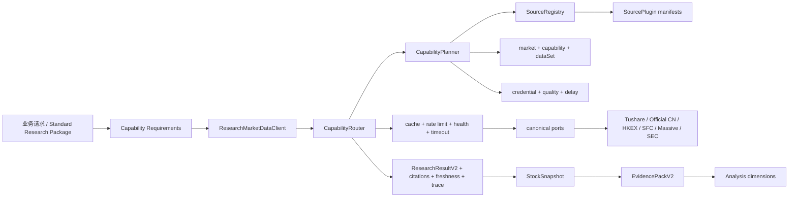

# Bourse 市场数据源接入技术方案

> 状态：实施基线 v2.2（代码已落地，商业源需凭证/套餐配置）
>
> 范围：`packages/market-data`、`packages/analysis` 的 Snapshot 边界、`apps/api` 的数据源装配
>
> 目标市场：US / CN / HK
>
> 原则：允许重构，但保持开源项目可理解、可选装、单进程可运行

## 1. 执行结论

当前 `packages/market-data` 的 v2 主干方向正确，不需要推倒重建。它已经具备：

- `SourcePlugin` 与 source manifest；
- 按市场、能力、证券类型、时间粒度筛选候选源；
- `fallback`、`merge`、`official-first`、`cross-check` 路由策略；
- 凭证隔离缓存、限流、超时、健康状态和 cooldown；
- canonical schema 校验、引用、freshness、warning 和路由 trace；
- 应用唯一入口 `ResearchMarketDataClient`。

本轮已完成扩展，且没有另建平台：

1. 新增 `corporate-actions`、`ownership`、`market-events` 三个正式 capability。
2. 给 capability 增加 `dataSet` 粒度，解决“一个供应商只拥有部分接口权限”的真实情况。
3. 把现有 CN 专属 tools 收口成 canonical port + source plugin，删除 API 层的 `toolToFetcher()` 绕路。
4. 把宏观模型从 8 个固定枚举升级为可扩展 series 模型。
5. 已接入 Tushare Pro、中国官方宏观 NBS、SFC 每周卖空仓位和 HKEX 公告派生事件。
6. Massive REST 已作为可选商业插件；SEC 继续复用现有 watchlist 增量扫描，不新建消息平台。
7. 不实现默认 CCASS scraper；它的公开页面对自动化访问和用途有明确限制。

该方案满足核心目标：**数据源声明自己能提供的 market/capability/dataSet 和授权属性；业务声明自己需要的内容与质量约束；Router 根据市场、能力、凭证、质量、缓存、限流和可用性选择数据源。**

## 2. 对附件结论的校正

附件基于较早的代码状态，以下判断在当前工作树中已过时：

| 附件判断 | 当前事实 | 本方案处理 |
|---|---|---|
| financials / filings / macro 不是通用 fallback | 三者已经由统一 Router 路由 | 保留现有路由，不重复实现 |
| HK 财务只有东方财富 | 已有 `hkex-derived-financials -> eastmoney-hk-financials` | 只补公司行动和事件 |
| CN tools 仍在 analysis 内 | 实现已迁到 `market-data/connectors/cn-tools`，但 API 仍以旧 descriptor 直连 | 转成正式 port/plugin，删除直连 |
| SEC 需要从零做增量事件流 | 已有 5 分钟 watchlist scheduler、cursor 和 filing 去重 | 优化现有扫描；全市场 feed 延后 |

当前最重要的架构缺口不是“再多写几个 connector”，而是：

- manifest 只声明 capability，无法声明 `dividend`、`unlock`、`short-position` 等子数据集；
- `MacroPort` 的指标、频率、单位和 provider 都是封闭枚举；
- Snapshot 中 CN 专属结果仍为 `unknown`，且绕过统一 Router；
- 授权数据源尚无明确的 entitlement、缓存和再分发治理方式。

## 3. 数据源可接入性评审

### 3.1 总表

| 数据源 | 技术上可接 | 开源默认启用 | 凭证 | 许可/用途 | 建议角色 | 决策 |
|---|---:|---:|---|---|---|---|
| Tushare Pro | 是 | 否 | Token + 接口积分权限 | 授权数据，不默认允许公共再分发 | CN 结构化事件、公司行动、持仓主源/备源 | P1 接入为可选插件 |
| NBS 国家统计局 | 是，但接口稳定性一般 | 是 | 通常无 | 官方公开数据，仍需遵守网站条款 | CN 实体经济宏观主源 | P2 按系列接入 |
| PBOC 人民银行 | 是，多为页面/附件 | 是 | 通常无 | 官方公开数据 | 货币、社融、信贷主源 | P2 按系列接入 |
| SAFE 外汇局 | 是，多为页面/附件 | 是 | 通常无 | 官方公开数据 | 外储、结售汇主源 | P2 按系列接入 |
| ChinaMoney / CFETS | 是 | 条件启用 | 视端点而定 | 需逐项确认自动访问与缓存条款 | Shibor、回购、LPR 等 | P2，许可确认后启用 |
| ChinaBond | 技术上可访问部分查询 | 否 | 视服务而定 | 自动访问、缓存和再分发边界待确认 | 国债收益率曲线 | 先完成许可审查 |
| HKEX 公告派生事件 | 是 | 是 | 无 | 保留原公告链接，不替代原文 | HK 公司行动/事件权威派生源 | P3 接入 |
| HKEX 结构化数据产品 | 是 | 否 | 商业订阅 | 交易所产品许可 | HK 高质量结构化源 | 可选插件 |
| SFC 每周聚合卖空仓位 CSV | 是 | 是 | 无 | 官方公开下载，保留来源与日期 | HK short-position 主源 | P3 接入 |
| HKEX 每日沽空成交 | 可能 | 暂否 | 视端点而定 | 先确认公开下载与自动化条款 | HK 市场事件/持仓补充 | 条款确认后接 |
| CCASS 公开查询页 | 页面可人工使用 | **否** | 无 | 页面限制程序化访问及用途 | 不作为默认数据源 | 禁止实现 scraper |
| 持牌 CCASS/vendor | 是 | 否 | 商业凭证 | 按合同缓存/展示 | HK ownership 可选主源 | 插件化接入 |
| Massive | 是 | 否 | API Key + 套餐 | 交易所及套餐授权，不默认再分发 | US quote/history/profile；未来期权/流式 | P4 可选插件 |
| SEC submissions/companyfacts | 已接 | 是 | 无；需合规 User-Agent | 官方公开接口 | US filings/financials 主源 | 保持现状 |
| SEC daily index / bulk zip | 是 | 否 | 无 | 官方公开接口 | 未来全市场 filing-feed | 有明确需求再做 |

“开源默认启用”表示仓库可在无商业凭证的标准部署中启用，不代表数据可以脱离来源条款任意再分发。

### 3.2 Tushare Pro（已实现）

采用 TypeScript 直接 POST `https://api.tushare.pro`，不引入 Python SDK。请求由 `api_name`、`token`、`params`、`fields` 组成，connector 对返回字段做 Zod 校验和 canonical normalize。

Tushare 的关键约束是权限按积分、接口和套餐分级。不能因为配置了 token 就在 manifest 中声明所有能力。实例化插件时必须传入经过确认的 `enabledDataSets`；遇到 `PERMISSION_DENIED` 时记录该 route attempt 并提示修正 entitlement 配置，不计入 source-wide 网络健康度，也不应让整个 Tushare source 熔断。

第一批建议映射：

| Tushare 数据 | Canonical capability/dataSet | 用途 |
|---|---|---|
| `trade_cal` | `market-calendar/session` | CN 交易日历 |
| `adj_factor` | `corporate-actions/adjustment-factor` | 复权与价格解释 |
| `dividend` | `corporate-actions/dividend` | 分红送配 |
| `repurchase` | `corporate-actions/buyback` | 回购 |
| `suspend_d` | `market-events/suspension` | 停复牌 |
| `stk_limit` | `market-events/price-limit` | 涨跌停价 |
| `forecast` / `express` | `market-events/earnings-guidance` | 业绩预告/快报 |
| `share_float` | `market-events/unlock` | 限售解禁 |
| `top_list` / `top_inst` | `market-events/lhb` | 龙虎榜 |
| `stk_holdernumber` | `ownership/shareholder-count` | 股东户数 |
| 沪深港通相关接口 | `ownership/stock-connect` | 持股或资金流 |
| `margin` / `margin_detail` | `ownership/margin` | 融资融券 |
| 指数权重/成分接口 | `market-events/index-rebalance` 或后续 reference data | 指数成分变化 |

不建议第一批把 Tushare 所有行情、财务、基金、期货和期权接口同时迁入。先补当前研究包真正缺失的数据；行情和财务可在后续作为 CN 现有 source 的 licensed fallback。

### 3.3 中国官方宏观（NBS 已实现，PBOC/SAFE 文件插件已实现）

不创建 provider-specific `CnOfficialMacroPort`。各站点实现同一个扩展后的 `MacroPort`，以 series 为最小接入和测试单元：

- NBS：PMI、CPI、PPI、工业增加值、社零、固定资产投资；
- PBOC：M1/M2、社融、人民币贷款、LPR；
- SAFE：外汇储备、银行结售汇；
- ChinaMoney/CFETS：Shibor、回购利率、LPR；
- ChinaBond：10Y 国债收益率仅在自动访问和缓存许可确认后启用。

这些来源多数不是稳定高 SLA JSON API。`authority` 可以是 `regulator`，但 transport 必须另行标记为 `official-api`、`official-html`、`official-file` 或 `scrape`。网页结构变化、附件列变化、日期列丢失不能返回“空数据”，必须返回 `INVALID_PAYLOAD` 并触发 fallback/cooldown。

### 3.4 HKEX、SFC 与 CCASS（已实现 HKEX/SFC；CCASS 禁止抓取）

1. `hkex-filings-derived` 从 HKEX 公告提取派息、供股、配股、回购、停复牌等事件，保留公告 URL、公告 ID、发布时间和语言。派生结果的 `authority` 为 `official-derived`，不是 `exchange` 原始结构化数据。
2. `sfc-short-position` 读取 SFC 每周聚合卖空仓位 CSV，按股票代码规范化为 `ownership/short-position`。
3. HKEX 每日沽空成交只有在确认下载方式与条款后再实现，不能把页面内部接口视为公共 API。
4. 不实现 CCASS 查询页 scraper。需要 CCASS 时，仅提供人工跳转链接，或让部署者安装持牌 vendor plugin。

### 3.5 Massive（已实现 REST，可选）

第一阶段只实现 REST：

- `quote`：US 最新报价；
- `history`：US 日线/分钟线；
- `profile`：公司 reference/profile。

manifest 必须由实际套餐声明 `delay: realtime | delayed | eod`、可用 interval、历史深度和 redistribution。WebSocket 不进入请求响应 Router；未来确需盘中推送时，应建立独立 ingestion service，把流式数据写入短周期 cache，再由 Router 读缓存。

期权、期货、外汇、加密和指数不能因为 Massive 能提供就自动扩大 Bourse 的产品边界。只有产品明确需要时才新增 `derivatives` 或其他资产域。

### 3.6 SEC 增量数据（保持现有实现）

当前实现已有合理的最小闭环：watchlist 股票 -> 每 5 分钟扫描 -> `FilingDetectionCursor` -> `[provider, sourceDocumentId]` 去重 -> 触发财报生成。因此第一阶段只做：

- 确保 SEC connector 继续使用实时更新的 submissions；
- 按 `lastSourceDocumentId`/filing date 减少重复读取；
- 保留指数退避、并发限制和 SEC User-Agent；
- 为 Form 4、13F 的 canonical ownership 派生预留 mapper，但不新建队列。

只有要做“全市场新公告发现”时，才新增 `filing-feed` capability、daily-index cursor 和 bulk backfill。该能力不属于当前标准研究包的前置条件。

## 4. 目标架构



依赖方向保持单向：

```text
apps/api
  -> packages/analysis (snapshot/evidence contracts)
  -> packages/market-data (client only)

packages/market-data
  contracts <- ports <- connectors
       ^          ^          |
       |          +------ source plugins
       +----------------- registry/planner/router
```

业务层不得 import connector、provider port 或 source ID。source ID 只允许出现在数据源装配、路由配置、运维 trace 和测试中。

## 5. Capability 与 dataSet 模型

### 5.1 为什么需要 dataSet

`corporate-actions` 只说明领域，不足以表达某个 token 只有分红权限、没有回购权限。若把每个细目都变成 capability，union 和路由策略会快速膨胀。采用两级模型：

```ts
type Capability =
  | 'quote'
  | 'history'
  | 'profile'
  | 'financials'
  | 'filings'
  | 'filing-document'
  | 'earnings-consensus'
  | 'macro'
  | 'instrument-search'
  | 'market-calendar'
  | 'corporate-actions'
  | 'ownership'
  | 'market-events';

type DataSet =
  | 'dividend'
  | 'split'
  | 'rights-issue'
  | 'placement'
  | 'buyback'
  | 'adjustment-factor'
  | 'shareholder-count'
  | 'stock-connect'
  | 'short-position'
  | 'institutional-position'
  | 'insider-transaction'
  | 'margin'
  | 'earnings-calendar'
  | 'earnings-guidance'
  | 'unlock'
  | 'lhb'
  | 'suspension'
  | 'price-limit'
  | 'index-rebalance'
  | 'regulatory-event'
  | 'macro-series'
  | 'session';
```

改动点：

```ts
interface CapabilitySpec {
  capability: Capability;
  dataSets?: readonly DataSet[];
  /** 仅 macro 使用；声明 source 真正实现的 canonical series。 */
  seriesCodes?: readonly string[];
  transport?: 'official-api' | 'vendor-api' | 'official-html'
    | 'official-file' | 'scrape' | 'derived';
  rateLimit?: { maxRequests: number; windowMs: number; concurrent?: number };
  // existing markets / securityTypes / intervals / quality / ttl / ...
}

interface RouteRequest {
  capability: Capability;
  dataSet?: DataSet;
  seriesCode?: string;
  constraints?: {
    minQualityTier?: QualityTier;
    acceptedDelays?: QuoteDelay[];
    maxAgeMs?: number;
  };
  // existing market / input / credentialScope / ...
}
```

`SourceRegistry.find()` 在 request 带 `dataSet` 或 `seriesCode` 时，只返回显式声明该项的 source。一个研究包中的多个 dataSet/series 分成多个 route request，各自独立 fallback；不要求某个 source 一次提供全部数据。

`RoutingPolicy` 同样增加可选 `dataSet`。查找顺序是 `(capability, market, dataSet)` 精确策略优先，其次回退到 `(capability, market)` 通用策略。请求级 `constraints` 与 policy 合并时取更严格值，因此业务可以要求“1 分钟内、至少 B 级、只接受 realtime”，但不能放宽系统设定的合规或质量下限。

### 5.2 业务需求声明

`packages/analysis` 声明研究包需要的数据，不写 provider：

```ts
interface DataRequirement {
  key: string;
  capability: Capability;
  dataSet?: DataSet;
  seriesCode?: string;
  required: boolean;
  maxAgeMs?: number;
  minQualityTier?: QualityTier;
  acceptedDelays?: QuoteDelay[];
}

const standardResearchPackage: DataRequirement[] = [
  { key: 'quote', capability: 'quote', required: true, maxAgeMs: 60_000 },
  { key: 'history', capability: 'history', required: true },
  { key: 'financials', capability: 'financials', required: true, minQualityTier: 'B' },
  { key: 'filings', capability: 'filings', required: true, minQualityTier: 'B' },
  { key: 'dividends', capability: 'corporate-actions', dataSet: 'dividend', required: false },
  { key: 'buybacks', capability: 'corporate-actions', dataSet: 'buyback', required: false },
  { key: 'ownership', capability: 'ownership', dataSet: 'stock-connect', required: false },
  { key: 'events', capability: 'market-events', dataSet: 'earnings-guidance', required: false },
];
```

P0 可先由 Snapshot 的静态配置生成这些 route request，不需要引入通用 DAG、规则 DSL 或数据库配置中心。`DataRequirement` 的质量字段必须原样进入 `RouteRequest.constraints`，不能只用于展示。

## 6. Canonical contracts

### 6.1 公司行动

```ts
interface CorporateAction {
  id: string;
  instrumentId: string;
  type: 'DIVIDEND' | 'SPLIT' | 'RIGHTS_ISSUE' | 'PLACEMENT' | 'BUYBACK' | 'ADJUSTMENT_FACTOR';
  status: 'ANNOUNCED' | 'CONFIRMED' | 'COMPLETED' | 'CANCELLED' | 'UNKNOWN';
  announcedAt?: string;
  exDate?: string;
  recordDate?: string;
  paymentDate?: string;
  effectiveDate?: string;
  cashAmount?: string;
  currency?: string;
  ratioNumerator?: string;
  ratioDenominator?: string;
  price?: string;
  sourceDocumentId?: string;
}

interface CorporateActionsPort {
  listActions(input: {
    instrumentId: string;
    types?: CorporateAction['type'][];
    from?: string;
    to?: string;
  }, ctx?: ConnectorRunContext): Promise<SourceResult<CorporateAction[]>>;
}
```

金额和比率采用十进制字符串，避免金融数据在跨源 merge 时产生浮点误差。

### 6.2 持仓与资金

```ts
interface OwnershipObservation {
  id: string;
  instrumentId: string;
  kind: 'SHAREHOLDER_COUNT' | 'STOCK_CONNECT' | 'SHORT_POSITION'
    | 'INSTITUTIONAL_POSITION' | 'INSIDER_TRANSACTION' | 'MARGIN';
  asOf: string;
  holderName?: string;
  direction?: 'BUY' | 'SELL' | 'LONG' | 'SHORT' | 'NET';
  value: string;
  unit: 'shares' | 'holders' | 'percent' | 'currency';
  currency?: string;
  periodStart?: string;
  periodEnd?: string;
  sourceDocumentId?: string;
}

interface OwnershipPort {
  listOwnership(input: {
    instrumentId: string;
    kind: OwnershipObservation['kind'];
    from?: string;
    to?: string;
    limit?: number;
  }, ctx?: ConnectorRunContext): Promise<SourceResult<OwnershipObservation[]>>;
}
```

北向/南向“持股”和市场整体“资金流”必须使用不同 unit 和 kind，不得把成交净额当作个股持股变化。

### 6.3 市场事件

```ts
interface MarketEvent {
  id: string;
  instrumentId: string;
  type: 'EARNINGS_DATE' | 'EARNINGS_GUIDANCE' | 'EXPRESS_REPORT' | 'UNLOCK'
    | 'LHB' | 'SUSPENSION' | 'RESUMPTION' | 'PRICE_LIMIT'
    | 'INDEX_REBALANCE' | 'REGULATORY_EVENT';
  occurredAt: string;
  effectiveAt?: string;
  title: string;
  status?: 'SCHEDULED' | 'CONFIRMED' | 'COMPLETED' | 'CANCELLED';
  amount?: string;
  shares?: string;
  currency?: string;
  tags?: string[];
  attributes?: Record<string, string | number | boolean | null>;
  sourceDocumentId?: string;
}

interface MarketEventsPort {
  listEvents(input: {
    instrumentId: string;
    types?: MarketEvent['type'][];
    from?: string;
    to?: string;
    limit?: number;
  }, ctx?: ConnectorRunContext): Promise<SourceResult<MarketEvent[]>>;
}
```

### 6.4 宏观 series 模型

```ts
interface MacroObservation {
  market: 'US' | 'CN' | 'HK';
  seriesCode: string;          // canonical，例如 CN.CPI.YOY
  category: 'growth' | 'inflation' | 'employment' | 'money'
    | 'credit' | 'rates' | 'fx' | 'trade' | 'property';
  name: string;
  value: string;
  unit: string;
  frequency: 'DAILY' | 'WEEKLY' | 'MONTHLY' | 'QUARTERLY' | 'ANNUAL';
  periodStart: string;
  periodEnd: string;
  releasedAt?: string;
  revisedAt?: string;
  seasonalAdjustment?: 'SA' | 'NSA' | 'UNKNOWN';
  providerSeriesId: string;
}

interface MacroInput {
  market: 'US' | 'CN' | 'HK';
  seriesCodes?: string[];
  categories?: MacroObservation['category'][];
  from?: string;
  to?: string;
  limitPerSeries?: number;
}
```

`periodEnd` 表示数据归属期，`releasedAt` 表示市场何时可知，二者不能互换。缺少 `releasedAt` 时必须显式为空，不能用抓取时间伪造。

当 `MacroInput.seriesCodes` 含多个 series 时，client 在内部拆成逐 series route request，再合并 canonical observations。这样 NBS、PBOC、SAFE 可以分别只声明自己实际提供的 series，而不是共同冒充一个全能的 `official-macro` source。

## 7. Source plugin 与路由配置

### 7.1 Tushare effective manifest

```ts
interface TushareConfig extends SourceConfig {
  token: string;
  enabledDataSets: DataSet[];
  requestsPerMinute?: number;
}

const tushareManifest = {
  id: 'tushare-pro',
  sourceType: 'licensed-vendor',
  requiresAuth: true,
  allowRedistribution: false,
  capabilities: buildFromEnabledDataSets(config.enabledDataSets),
  rateLimit: { concurrent: 2, maxRequests: configuredRpm, windowMs: 60_000 },
};
```

`enabledDataSets` 是部署者确认后的权限清单。connector 不在启动时遍历调用所有接口探测权限，避免耗尽配额；可提供单独的 `pnpm --filter @bourse/market-data source:check tushare` 诊断命令。

现有 limiter 只有一秒固定窗口，P1 将 source rate limit 扩为通用 `{ maxRequests, windowMs, concurrent }`。内存实现继续满足单进程开源部署；不同接口若配额不同，manifest 按 capability/dataSet 声明 override，Planner 将选中候选的有效配额传给 limiter。暂不引入 Redis 分布式限流。

### 7.2 建议 source IDs

| Source ID | capability/dataSet | authority | redistribution |
|---|---|---|---|
| `tushare-pro` | 配置允许的 CN dataSets | `licensed` | `credential-cache-only` |
| `cn-public-events` | 现有东财 CN tools 对应 dataSets | `aggregated` | 审核后决定，保守用 `no-store` |
| `nbs-cn-macro` | `macro/macro-series` | `regulator` | `public-cache-allowed` |
| `pboc-cn-macro`（配置官方 CSV 后） | `macro/macro-series` | `regulator` | `public-cache-allowed` |
| `safe-cn-macro`（配置官方 CSV 后） | `macro/macro-series` | `regulator` | `public-cache-allowed` |
| `chinamoney-macro` | `macro/macro-series` | `official-derived` | 条款确认后配置 |
| `chinabond-macro` | `macro/macro-series` | `official-derived` | 默认禁用 |
| `hkex-filings-derived-events` | HK actions/events | `official-derived` | `public-cache-allowed` |
| `sfc-short-position` | HK `ownership/short-position` | `regulator` | `public-cache-allowed` |
| `massive` | US quote/history/profile | `licensed` | `credential-cache-only` 或 `no-store` |
| `sec-filings-derived` | US ownership/events | `official-derived` | `public-cache-allowed` |

### 7.3 默认 policies

```ts
// CN
corporate-actions/dividend: official-first [tushare-pro, cn-filings-derived, cn-public-events]
corporate-actions/buyback:  official-first [tushare-pro, cn-filings-derived, cn-public-events]
ownership/shareholder-count: fallback [tushare-pro, cn-public-events]
ownership/stock-connect:      fallback [tushare-pro, cn-public-events]
market-events/unlock:         fallback [tushare-pro, cn-public-events]
market-events/lhb:            fallback [tushare-pro, cn-public-events]
market-events/earnings-guidance: official-first [cn-filings-derived, tushare-pro]
macro/macro-series:           merge [nbs-cn-macro, pboc-cn-macro, safe-cn-macro, chinamoney-macro]

// HK
corporate-actions/*: official-first [hkex-filings-derived-events, licensed-hk-vendor]
market-events/*:     official-first [hkex-filings-derived-events, licensed-hk-vendor]
ownership/short-position: official-first [sfc-short-position, licensed-hk-vendor]
ownership/stock-connect:  fallback [licensed-hk-vendor]

// US
quote/history/profile: fallback [massive, twelve-data, alpha-vantage, eodhd, yahoo, ...]
ownership/insider-transaction: official-first [sec-filings-derived]
ownership/institutional-position: official-first [sec-filings-derived]
```

宏观 `merge` 不能简单拼数组。以 `seriesCode + periodEnd + seasonalAdjustment` 去重，优先 regulator；同一 key 数值冲突时保留主值并发出 `DATA_CONFLICT`，trace 记录所有来源。

## 8. 完整请求数据流：HK:0700 标准研究包

1. API 接收 `market=HK, symbol=0700`，统一为 canonical `HK:0700`。
2. `packages/analysis` 用 `STANDARD_RESEARCH_REQUIREMENTS` 展开需求：quote、history、profile、financials、filings、macro、dividend、buyback、earnings event、short position；未配置的 stock-connect/CCASS 是 optional。
3. 每个 requirement 调用 `ResearchMarketDataClient`，业务层不传 source ID。
4. Registry 先按 HK market 排除只支持 US 的 `massive`，Router 再规划 Twelve Data、EODHD、Yahoo、Tencent HK；逐个检查凭证、delay、health、rate limit 和 cache。
5. financials 走 `hkex-derived-financials -> eastmoney-hk-financials`；前者失败或空数据才 fallback。
6. filings 走 HKEX；结果携带公告 ID、URL、发布日期、语言和 freshness。
7. dividend/buyback/earnings event 走 `hkex-filings-derived-events`；parser 从公告中产生 canonical records，citation 始终指向原公告。
8. short position 走 `sfc-short-position`，读取目标周 CSV 并按 `0700` 过滤。当前周未发布时，可返回上一期且 freshness 明确 `asOf`；不得伪装为实时数据。
9. stock-connect/CCASS 若无持牌插件，Router 返回 `AUTH_REQUIRED` 或 `UNSUPPORTED_CAPABILITY`，Snapshot 将其标记 optional missing，不阻断整份研究包。
10. macro 根据 HK 既有 HKMA/World Bank series 路由；本轮不让 CN 宏观 connector 混入 HK。
11. 每条结果先过 connector schema，再过 source wrapper，Router 输出 `ResearchResultV2`，包括 selected/merged sources、attempts、citations、freshness 和 warnings。
12. Snapshot 聚合并计算技术指标、财务比率与红旗；canonical actions/ownership/events 同时写入 `RawFacts`，结构化缺失写入 `dataAvailability`。
13. `snapshotToEvidencePack()` 只做类型明确的映射，不再猜测 `.rows`/`.events` 等 provider shape。
14. 各分析维度读取过滤后的 EvidencePack；必要的新闻和最新叙事仍由 analysis web search 补充，不能覆盖 canonical 数值事实。

这条链路中的降级是局部的：SFC 或 HKEX 失败不会让 quote/financials 失败；缺少商业 CCASS 凭证也不会阻断标准报告。

## 9. 新增一个数据源的标准流程

以新增 `licensed-hk-vendor` 为例：

1. 在 `connectors/<domain>/licensed-hk-vendor.ts` 实现一个或多个 provider connector，只处理认证、HTTP、provider schema 和 normalize。
2. 为每个 provider payload 建 Zod schema；provider 返回 200 + 错误对象时映射成 `AUTH_INVALID`、`PERMISSION_DENIED`、`RATE_LIMITED` 等标准错误。
3. 在 `sources/plugins/licensed-hk-vendor.ts` 定义 plugin factory；根据实际套餐生成 effective manifest。
4. manifest 只声明已验证的 market/capability/dataSet/securityType/interval/delay，不声明“供应商理论上支持”的能力。
5. API composition 从环境变量构造 config。API key 只传入 factory，不能进入 request input、cache key、warning、trace 或日志。
6. 把 source ID 加入对应 policy 的候选顺序；不修改业务代码。
7. 增加 fixture parser test、plugin/manifest test、router integration test、credential cache test 和可选 smoke test。
8. 更新 source matrix 文档，注明权限、TTL、限频和 redistribution。

新增源后，业务请求完全不变。只有 manifest 与 policy 改变，Router 会自动在满足约束时选用新源。

## 10. Snapshot 与 EvidencePack 迁移

P0 必须消除当前 API 的 `toolToFetcher()`：

```text
现状：SnapshotV2Service -> CN ToolDescriptor -> Eastmoney/CNInfo
目标：SnapshotV2Service -> ResearchMarketDataClient -> Router -> CN source plugin
```

具体变更：

- 将 `consensusEps` 保持在已存在的 `earnings-consensus` 或明确拆分旧字段，避免重复能力；
- `northboundFlow`/股东户数映射到 `OwnershipObservation[]`；
- `lhb`/解禁映射到 `MarketEvent[]`；
- `RawFacts` 用正式类型替换上述 `unknown`；
- `profile` 使用 `CompanyProfile`，`macro` 使用新的 `MacroSnapshot`；
- Snapshot fetcher 接收 `ResearchResultV2` envelope，完整保留 trace/citation/freshness；
- `snapshotToEvidencePack()` 不兼容多种 provider wrapper；兼容逻辑只留在 connector normalize 层。

迁移期间可保留一个版本内的 adapter，但 adapter 必须位于 `market-data` source plugin 边界，且带 removal issue；不能继续留在 `apps/api`。

## 11. 配置、凭证与 entitlement

建议新增环境变量：

```dotenv
TUSHARE_TOKEN=
TUSHARE_ENABLED_DATASETS=dividend,buyback,unlock,lhb,shareholder-count,stock-connect
TUSHARE_REQUESTS_PER_MINUTE=40

MASSIVE_API_KEY=
MASSIVE_ENABLED_CAPABILITIES=quote,history,profile
MASSIVE_QUOTE_DELAY=delayed
MASSIVE_HISTORY_INTERVALS=1d,1h,5m,1m

ENABLE_NBS_MACRO=true (当前由 createMarketData 默认注册)
PBOC/SAFE 官方文件通过 `CreateMarketDataOptions.officialMacroFiles` 注入
ENABLE_CHINAMONEY_MACRO=false
ENABLE_CHINABOND_MACRO=false
SFC_SHORT_POSITION_CSV_URL=  # required; verify current SFC download URL before setting
```

约束：

- `packages/market-data` 不读 `process.env`；`apps/api` 负责解析、校验并传入 typed config；
- token 不进入 source manifest；
- credential cache scope 使用不可逆 token fingerprint，例如 `credential:tushare:<12-char-sha256>`，不使用裸 token；
- 开源默认配置在无商业 key 时仍可启动，缺少 optional source 只表现为未注册；
- configured dataSet 与真实权限不一致时，返回 `PERMISSION_DENIED` 并在诊断中提示修正配置。

## 12. 缓存、限流、freshness 与合规

| 数据 | 建议 TTL | stale-if-error | 备注 |
|---|---:|---:|---|
| quote realtime | 5-15 秒 | 否 | 必须按套餐 delay 标记 |
| quote delayed/EOD | 1-15 分钟 | 否 | UI 显示 as-of/delay |
| daily history | 6 小时 | 24 小时 | 收盘后可延长 |
| 公司行动/事件 | 15-60 分钟 | 24 小时 | 取消/修订事件需覆盖旧版本 |
| ownership 日频 | 1-6 小时 | 24 小时 | 周频 SFC 按发布日期缓存 |
| filings 索引 | 10 分钟 | 1 小时 | 文档正文可缓存 24 小时以上 |
| 宏观 series | 1-6 小时 | 7 天 | freshness 以数据发布日判断 |

实施规则：

- licensed source 默认 `credential-cache-only`，不跨 token 共享；合同要求不落盘时使用 `no-store`；
- public cache 只缓存 canonical result，不缓存含 cookie/token 的原始响应；
- cache key 必须包含 source、capability、dataSet/seriesCode、canonical input 与 credential scope；
- rate limit 支持部署者配置，供应商不同接口的配额不能硬编码成一个“官方值”；
- `PERMISSION_DENIED` 不应按网络故障重试；429 遵循 `Retry-After` 并触发 fallback；
- 官方 HTML/file parser 必须保存脱敏 fixture、内容 hash 和 schema version；
- 所有展示数据带 provider、asOf、retrievedAt、delay、citation；
- README 明确数据源条款由部署者负责确认，本项目不提供绕过访问控制的代码。

## 13. 错误、质量与 fallback

标准分类：

| 情况 | 标准结果 | Router 行为 |
|---|---|---|
| 合法查询但确实无记录 | `empty` / `EMPTY_RESPONSE` | 尝试下一源；可记录正常缺失 |
| provider schema 变化 | `failed` / `INVALID_PAYLOAD` | fallback；计入 source health |
| normalize 后违反 canonical schema | `failed` / `VALIDATION_FAILED` | fallback；禁止缓存 |
| 未配置凭证 | candidate `AUTH_UNAVAILABLE` | 跳过，返回 auth warning |
| token 无接口权限 | `PERMISSION_DENIED` | 不重试该源，fallback |
| 429 | `RATE_LIMITED` + retryAfter | fallback，限流器更新 |
| 网络/5xx | `SOURCE_UNAVAILABLE` | fallback，连续失败 cooldown |
| 全部 live source 失败 | stale cache（仅政策允许） | 返回 `partial + STALE_DATA` |
| 多源值冲突 | `partial + DATA_CONFLICT` | 保留权威主值和所有引用 |

质量等级建议：监管/交易所原始结构化数据 A；官方公告解析或官方页面派生 A/B（取决于解析完整性）；持牌聚合 B；公共聚合 C；网页抓取 C/D；纯派生值需同时记录输入来源。

## 14. 文件与模块改动清单

```text
packages/market-data/src/
  contracts/source.ts                 # Capability + DataSet + transport
  ports/
    corporate-actions.ts              # new
    ownership.ts                      # new
    market-events.ts                  # new
    macro.ts                          # series model rewrite
  connectors/
    tushare/                           # client + domain mappers
    macro-cn/                          # nbs/pboc/safe/chinamoney
    corporate-actions/                # filing-derived mappers
    ownership/sfc-short-position.ts
    finance/massive.ts                # optional
  sources/
    plugins/                           # new source plugin factories
    registry.ts                       # dataSet/seriesCode matching
    built-in.ts                       # only truly default sources
    rate-limit.ts                     # generic window + concurrency
  routing/
    planner.ts                        # dataSet filter/diagnostics
    policy.ts                         # exact dataSet + generic policies
  client.ts                           # three canonical public methods
  scripts/source-check.ts             # opt-in credential smoke

packages/analysis/src/
  snapshot/types.ts                   # replace unknown with canonical types
  snapshot/market-config.ts           # remove CN ToolDescriptor extras
  snapshot/fetch-snapshot.ts          # requirement-driven calls
  snapshot/to-evidence-pack.ts        # typed one-to-one mapping
  requirements/standard-research.ts   # small static requirement list

apps/api/src/
  connectors/connectors.module.ts     # env -> typed plugin config
  analysis/snapshot-v2.service.ts     # client-only, remove toolToFetcher

docs/
  data-sources.md                     # support/credential/license matrix
```

不需要新增数据库表即可完成 P0-P3。若未来要持久化公司行动/事件提醒，再单独设计 event identity、revision 和 subscription 表。

## 15. 分阶段实施

### P0：契约与路由收口

- 新增 3 个 capability/port 和 `dataSet` 匹配；
- 重写 Macro contract；
- 把 CN tools 转为 source plugins；
- 删除 `toolToFetcher()`，Snapshot/EvidencePack 去除相关 `unknown`；
- 增加 route、cache、fallback、schema tests。

验收：所有结构化市场数据都只能经 `ResearchMarketDataClient` 进入 Snapshot；业务层无 provider import。

### P1：Tushare 可选插件

- 通用 POST client、错误分类、token fingerprint；
- 优先接 dividend、buyback、suspension、price-limit、forecast/express、unlock、LHB、shareholder count、stock connect、trade calendar、adj factor；
- 增加显式 entitlement 配置和 source-check。

验收：同一业务请求在有 token 时可选择 Tushare，无 token 时自动使用公开 fallback 或结构化降级。

### P2：中国官方宏观

- 接 NBS/PBOC/SAFE 的首批 series；
- ChinaMoney 经条款确认后启用；
- parser fixture、schema drift 与 release-time 测试。

验收：CN 标准包能返回至少 CPI/PPI/PMI/M2/社融/LPR/外储，逐项显示周期、发布日期与来源；单站失败不清空整个 macro snapshot。

### P3：HK 事件与卖空仓位

- HKEX filing-derived actions/events；
- SFC weekly short-position CSV；
- CCASS 明确保持 unsupported，持牌插件接口可扩展。

验收：`HK:0700` 可获得带公告 citation 的派息/回购/业绩事件，以及最新可用 SFC 周频卖空仓位；缺少 CCASS 不阻断报告。

### P4：Massive 与 SEC 增强

- Massive REST finance plugin；
- 根据套餐声明 delay/interval/redistribution；
- 优化 SEC watchlist 增量扫描；
- 有全市场事件产品需求后再评估 daily index feed。

## 16. 测试与验收标准

### 16.1 单元测试

- 每个 provider payload：正常、空、字段缺失、错误对象、429、权限不足；
- canonical Zod：金额、日期、单位、证券代码、重复 ID；
- HKEX/PBOC/NBS HTML/file parser 使用固定 fixture；
- macro revision 和 `periodEnd`/`releasedAt` 不混淆；
- Tushare enabledDataSets 与 effective manifest 一致。

### 16.2 路由测试

- market/capability/dataSet 不匹配的 source 永不调用；
- 无凭证 source 被跳过，且 key 不出现在 trace；
- quality/delay 不满足请求时被跳过；
- cache hit 不占 provider 限流；
- 429、timeout、invalid payload 会 fallback；
- stale-if-error 仅在 manifest 与 policy 同时允许时生效；
- `merge` 去重，`cross-check` 数值冲突生成 warning；
- cooldown 后 source 暂时不再调用，恢复后重新参与。

### 16.3 集成与 smoke

- 无凭证：US/CN/HK 原有标准研究不回归；
- Tushare：仅在用户提供测试 token 时跑 opt-in smoke，不进入默认 CI；
- 官方源：CI 使用 fixture，定时外部 smoke 只检查公开端点与 schema，不断言市场数值；
- `HK:0700`、`CN:600519`、`US:AAPL` 各保留一份去敏 golden result；
- 验证 trace 中没有 token、cookie、Authorization header 或完整 provider payload。

### 16.4 完成定义

以下条件全部成立才算完整实现：

1. 新能力有 canonical schema、provider port、source wrapper、manifest、policy 和 public client method。
2. Source manifest 的声明与 connector 实现、用户 entitlement 一致。
3. Snapshot 不再直接调用任何市场数据 connector/tool。
4. 每个事实都可追溯到 citation、asOf、retrievedAt 和 selected/merged source。
5. 授权源不会写入 public cache，CCASS 不存在默认 scraper。
6. 失败能结构化降级，不能用空数组掩盖解析失败。
7. 默认 CI 无商业凭证可通过，opt-in smoke 有独立说明。
8. `pnpm --filter @bourse/market-data test`、typecheck、analysis snapshot tests 和 API e2e 全部通过。

## 17. 明确不做

- 不创建 `TusharePort`、`MassivePort` 等 provider-specific 业务接口；
- 不一次新增 NewsPort、FundPort、DerivativesPort、ReferenceDataPort；
- 不把 Massive WebSocket 塞进同步 Router；
- 不建设 Kafka、事件总线、分布式限流或独立数据湖；
- 不做默认 CCASS scraper，也不绕过 WAF、验证码或访问控制；
- 不将所有 provider raw payload 持久化；
- 不把 web search 新闻结果当作 canonical 财务、持仓或公司行动数据；
- 不在没有产品需求时扩大到 JP/UK、期权、期货、外汇和加密。

## 18. 外部依据与验证边界

本方案评审依据包括公开页面和无需凭证的接口说明：

- Tushare 平台与接口文档：<https://tushare.pro/>
- SEC Developer Resources：<https://www.sec.gov/about/developer-resources>
- SEC EDGAR APIs：<https://www.sec.gov/search-filings/edgar-application-programming-interfaces>
- SFC Short Position Reporting：<https://www.sfc.hk/en/Regulatory-functions/Market/Short-position-reporting>
- SFC Aggregated Reportable Short Positions：<https://www.sfc.hk/en/Regulatory-functions/Market/Short-position-reporting/Aggregated-reportable-short-positions-of-specified-shares>
- HKEX CCASS Shareholding Search：<https://www3.hkexnews.hk/sdw/search/searchsdw.aspx>
- Massive 文档：<https://massive.com/docs>
- ChinaMoney：<https://www.chinamoney.com.cn/>

本轮没有使用真实 Tushare/Massive API Key 做套餐权限、限频或字段质量实测。所有商业源的 effective manifest 必须以部署者的实际合同和 opt-in smoke 结果为准；公开页面条款也应在实施时再次核对。
