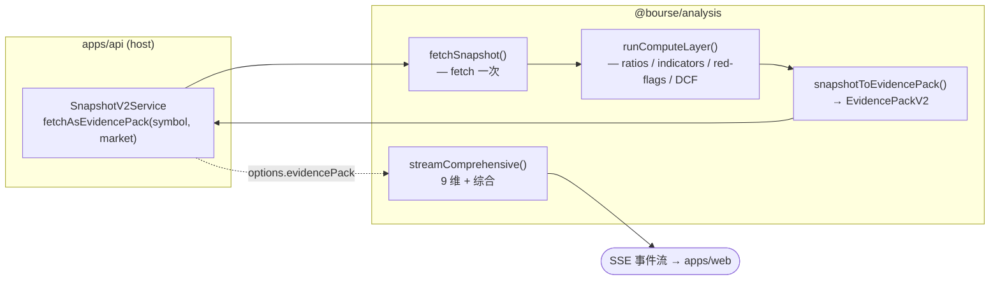
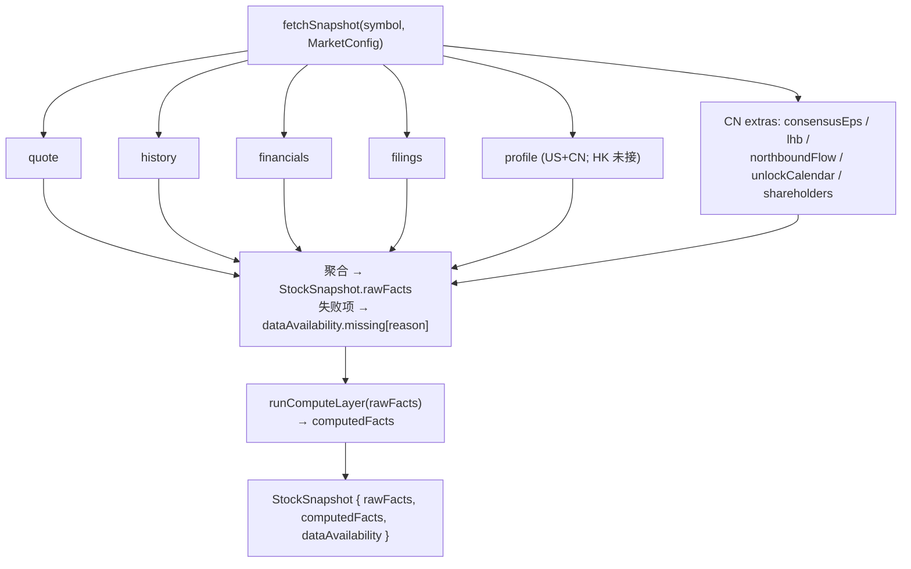
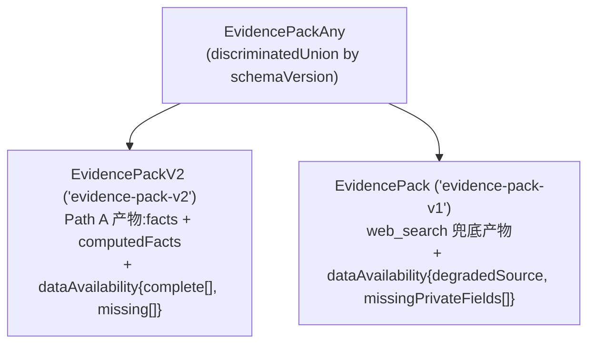
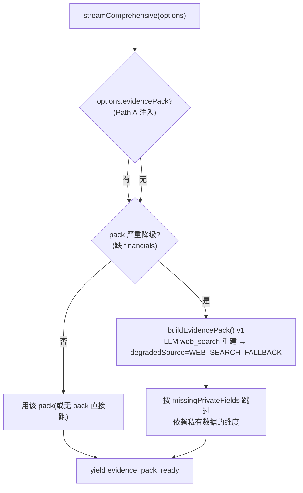
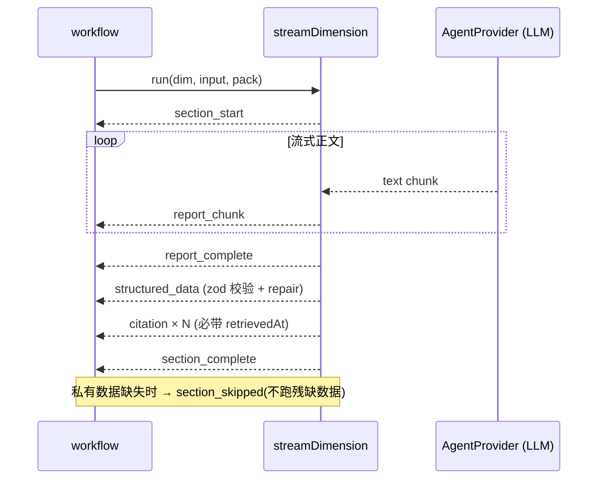
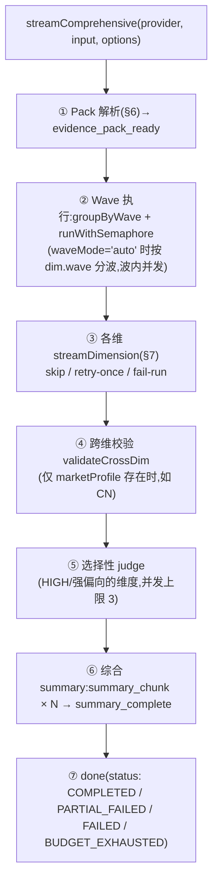

# `@bourse/analysis` — 功能说明

> Framework-free 核心包。承载 connectors + compute + snapshot + evidence pack +
> dimensions + workflows + SSE 契约 + evals。`apps/api` 是唯一的 host(NestJS 注入
> 端口、驱动 SSE),`apps/web` 只消费 SSE 契约。
>
> 依赖图:`shared-types ← analysis ← apps/{api,web}`。
>
> 本文反映 **Path A 恢复 + Stage-0 删除后**的终态(2026-05-30)。历史的 Stage-0
> 内部 builder(`buildEvidencePackV2`)与双层包装工具(`quoteSnapshot`/`filingSearch`)
> 已删除;结构化 evidence pack 现在**只有一条来源**:Path A。

---

## 1. 这个包做什么

把"一支股票的代码"变成"九维 AI 分析 + 综合结论",同时严守一条铁律:
**数字由代码算,LLM 只负责解读**。

整条链路:

要点:`apps/api` 先在 host 侧把 pack **预建好**(Path A),再通过
`options.evidencePack` 注入 `streamComprehensive`。workflow 不再自己拉数据。

---

## 2. 目录职责

| 目录 | 职责 |
|---|---|
| `contracts/` | 所有 public 类型的 **zod schema**(schema-first,TS 类型 `z.infer` 派生):evidence-pack(v1/v2)、sse-events、analysis-result、comprehensive-summary、cross-dim-validator、enums |
| `ports/` | 连接器抽象接口(FinancePort / FinancialsPort / FilingPort + cache / rate-limiter)。host 注入实现 |
| `connectors/` | 端口实现:finance(Yahoo / eastmoney)、financials(SEC XBRL / eastmoney)、filings(EDGAR / CNInfo)、search |
| `snapshot/` | **fetch 一次** + 投影成 evidence pack:`fetch-snapshot` / `to-evidence-pack` / `market-config` / `fact-filter` |
| `compute/` | **代码计算层**:ratios / technical-indicators / red-flags / relative / peer-table / valuation-helpers / units / read-bundle |
| `dimensions/` | 9 维定义(`DIMENSION_CONFIGS` 单一真源 → `ALL_DIMENSIONS` 派生) |
| `workflows/` | `comprehensive`(9 维 + 综合 + wave 并发 + 校验 + judge)、`single`、`wave-executor` |
| `primitives/` | provider 抽象、structured-output、stream-dimension、judge、summary-prompts、dimension-prompts、evidence-pack-builder(v1 web_search 兜底)、validate-cross-dim |
| `tools/` | ToolMiddleware + 5 个 CN 信号工具(eastmoney) |
| `markets/` | US / CN / HK MarketProfile(domainTiers / sourcePriorities) |
| `personas/` | buffett / munger / burry / wood / damodaran / graham 视角 |
| `guardrails/` | 输出守卫 |
| `evals/` | judge + vendor-fixture compute 回归 |
| `util/` | content-hash / instrument-id / normalize-url |

---

## 3. 硬不变式(违反即 bug)

1. **代码计算,LLM 判断** — ratios / indicators / red flags / peer 对比 / 历史百分位
   / DCF 由 `compute/` 算出,prompt 注入结果让 LLM 解读;**禁止** LLM 自己推导数字。
2. **fetch 一次** — 一次 `fetchSnapshot(symbol)` 拉齐所有 connector 数据,9 维共享。
3. **Snapshot 是值** — 不持久化中间态,只持久化用户可见结果。
4. **Schema-first** — public 类型先写 zod,TS 类型 `z.infer` 派生。
5. **Provenance 必填** — citation 必带 `retrievedAt`;pack 级 `citations[]`。
6. **Auth + CSRF** — 在 host 侧强制(本包 framework-free,不涉及)。

---

## 4. fetchSnapshot —— fetch 一次

`fetchSnapshot(symbol, config, options)` 并发拉取一个市场的全部数据源,**任一源失败
被捕获**并降级到 `dataAvailability`,绝不让整次抓取崩。

- connector 数据走 `portToFetcher`(包装 host 注入的端口)。
- CN 5 个信号走 `toolToFetcher`(包装 `ToolDescriptor.run()`);失败带结构化 reason
  码进 `dataAvailability`,而非静默空。
- **fetch 一次**:9 维不再各自拉数据,全部读这一个 snapshot。

> **profile**:US(Yahoo assetProfile)+ CN(eastmoney F10 RPT_F10_BASIC_ORGINFO)
> 已接,落 `facts.profile`(sector/industry/description/employees/website)。HK 暂无
> profile 源(未接)。
>
> **financials**:US(SEC XBRL)/ CN(eastmoney)/ HK(eastmoney F10
> RPT_HKF10_FN_MAININDICATOR,报告币种取自 INCOME.CURRENCY_CODE)均已接。

---

## 5. 计算层(compute)—— 不变式 #1 的载体

`runComputeLayer` 把 `rawFacts` 喂给纯函数,产出 `computedFacts`,prompt 只引用这些值。

| 模块 | 产出 |
|---|---|
| `financial-ratios` | PE / PB / ROE / 毛利率 / 负债率 等 |
| `technical-indicators` | MA / RSI / 波动率 / 趋势 |
| `red-flags` | 规则触发的风险旗标 |
| `relative` | 历史百分位(自身时间序列定位) |
| `peer-table` | 同业对比表 |
| `valuation-helpers` | DCF / EV 等估值辅助 |
| `units` / `read-bundle` | 单位归一化 + 安全读数(safeDiv / pickAnchor / EV 计算) |

---

## 6. Evidence Pack —— 喂给 LLM 的契约

- **V2** 是生产正路:`snapshotToEvidencePack(snapshot)` 把 rawFacts + computedFacts
  扁平投影,dimension prompts 实际消费它。
- **V1** 仅在 web_search 兜底时出现(下一节)。
- `formatEvidencePackBlock(v2Pack, allowWebSearchGaps)` 把 V2 渲染进 dimension prompt;
  默认明令 LLM **"数字字段必须引用 pack 内值,不允许 web_search 重取"**。开启
  `allowWebSearchGaps`(env `ANALYSIS_DIM_WEB_SEARCH_GAPS`,默认关)后,**仅** pack 标
  missing 的字段允许 LLM 自主 web_search 补,补来的值须标 `(网搜补充·未经代码核验)`、
  不得覆盖代码核验值、不得参与比率重算(守 #1)。

### Pack 解析 + 市场无关的 web_search 兜底

- **严重降级** = `isPackCriticallyDegraded`:`dataAvailability.complete` 缺 `financials`
  (核心基本面输入)。
- 恢复是 **market-agnostic** 且**生产恒开**(apps/api 对每次 run 启用;原 per-user
  opt-in 已废弃,见 improve.md)。单元测试通过 `allowWebSearchFallback` 显式开关隔离。

> ✅ **B 已落地 + 按字段自主补抓(flagged)**:整包恢复触发已放宽为「缺 financials 即
> 触发」且生产恒开。另:`allowWebSearchGaps`(env,默认关)开启后,维度 LLM 可对 pack
> 标 missing 的字段**按字段自主 web_search 补**,补来的值打 `(网搜补充·未经代码核验)`
> 标记、隔离于 compute 权威计算(compute 在 snapshot 阶段已跑完,物理上无法被回灌)
> ——守住 #1。

---

## 7. 单维流水线 streamDimension

每一维都是一条 7 段事件流水线:

9 维:`FUNDAMENTAL` `VALUATION` `TECHNICAL` `SENTIMENT` `RISK` `GOVERNANCE`
`INDUSTRY` `SCENARIO` `PORTFOLIO`。每维通过 `requiresPrivateData` 声明对 CN 私有
信号(northboundFlow / lhb / unlockCalendar / consensusEps)的依赖,用于降级跳过。

---

## 8. 综合工作流 streamComprehensive

- **失败语义**:`skip`(记失败、继续)/ `retry-once`(重试一次再跳)/ `fail-run`
  (在 summary 前停,status=FAILED)。
- **预算**:`budget.maxTokens / maxCostUsd / maxToolCalls` 在维度边界检查,超限 →
  `BUDGET_EXHAUSTED`。
- **执行模式**:默认顺序流式执行;需要并发时使用 `waveMode:'auto'` 分波执行。
- `single` workflow(`streamSingle`)是单维精简版,跳过 wave / 校验 / judge。

---

## 9. SSE 事件契约(`contracts/sse-events.ts`)

| 事件 | 时机 |
|---|---|
| `evidence_pack_ready` | pack 解析完成(前端据此读 degradedSource) |
| `section_start` / `report_chunk` / `report_complete` | 单维正文流 |
| `structured_data` | 单维结构化结论(zod) |
| `citation` | 引用(必带 retrievedAt) |
| `section_complete` / `section_skipped` | 单维结束 / 降级跳过 |
| `judge_start` / `judge_complete` | 选择性 judge |
| `summary_chunk` / `summary_complete` | 综合结论 |
| `cost_update` | 边界处成本/用量 |
| `web_search_warning` | web_search 软告警 |
| `done` / `error` | 终态 |

前端契约稳定;`apps/api` 的 adapter 负责把这些事件投影成 apps/api 的 SSE 形状 +
写 `Analysis` / `AnalysisSection` 行。

---

## 10. 市场 & CN 信号工具

- `markets/`:US / CN / HK 的 MarketProfile —— `domainTiers`(web_search 白名单 +
  质量分级)、`sourcePriorities`。仅 CN 配了 domainTiers。
- CN 5 个信号工具(eastmoney datacenter API,字段会随报表改版腐化,需定期校准):
  - `consensusEpsCN` — 一致预期 EPS(`RPT_WEB_RESPREDICT`)
  - `shareholdersCN` — 股东户数/人均(`RPT_F10_EH_HOLDERNUM`)
  - `unlockCalendarCN` — 限售解禁(`RPT_LIFT_STAGE`)
  - `lhbScanCN` — 龙虎榜
  - `akshareNorthboundCN` — 北向资金

---

## 11. Evals

- `eval:judge` / vendor-fixture:用真实 fixture 回归 compute 层,防止 ratios /
  indicators 计算漂移。
- 集成测试 `apps/api/.../snapshot-v2.e2e.spec.ts`(mock 连接器)验证 Path A 装配:
  US 产出 `computedFacts.ratios.pe`、CN 携带 5 个信号、硬失败优雅降级。
