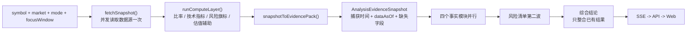
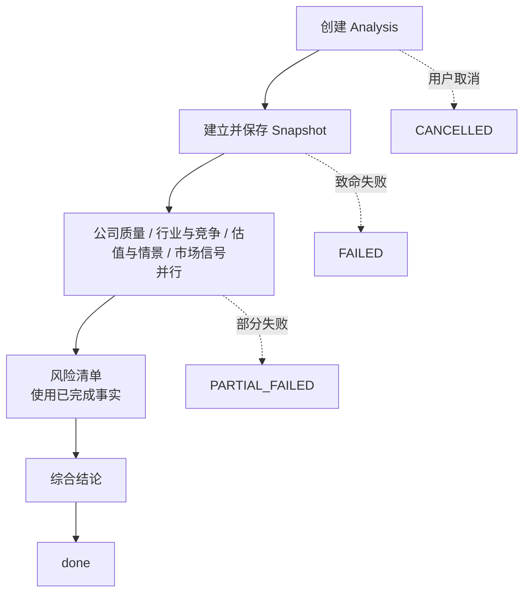

# `@bourse/analysis` 功能说明

> `@bourse/analysis` 是无框架的研究核心包。它负责连接器、一次性事实快照、确定性计算、证据契约、五个研究模块和 SSE 事件；`apps/api` 负责认证、持久化和运行生命周期，`apps/web` 只消费 API 契约。
>
> 依赖关系：`shared-types <- analysis <- apps/{api,web}`。
>
> 本文只描述 Analysis V2 的当前产品契约。Analysis 数据按空库上线，旧报告不迁移、不兼容。

---

## 1. 目标与边界

输入一支股票、研究模式和时间窗，输出一份带来源的研究报告。客观事实由代码和数据连接器提供，LLM 只负责解释、归纳和组织语言。

Analysis V2 固定运行五个模块：

| 顺序 | 模块 | 负责的问题 | 不负责的问题 |
|---|---|---|---|
| 1 | `COMPANY_QUALITY` 公司质量 | 商业模式、收入利润现金流、资本效率、资产负债表和经营韧性 | 行业排名、股价贵不贵、完整风险清单 |
| 2 | `INDUSTRY_POSITION` 行业与竞争 | 行业结构、增长驱动、竞争对手、市场位置、护城河、替代和监管 | 重写完整财务、目标价 |
| 3 | `VALUATION_SCENARIOS` 估值与情景 | 当前价格隐含的假设、估值方法和悲观/基准/乐观区间 | 单一目标价、买卖或仓位建议 |
| 4 | `RISK_REGISTER` 风险清单 | 会使当前判断失效的风险、机制、监测指标和失效条件 | 重新写完前序模块 |
| 5 | `MARKET_SIGNALS` 市场信号 | 价格、波动、成交量和代码计算的技术指标 | 把价格走势当作公司质量证据、精确买卖点 |

四个事实模块并行；风险模块在事实模块之后运行，因为它可以引用前序结果；最后生成一份综合结论。所有五个模块都会运行，`QUICK` 只减少每个模块的研究轮数和搜索量，不减少模块数量。

明确不做：事件专项、自定义日期、单模块新建分析、跨股票比较、用户自定义 token/调用预算、自动交易和仓位建议。

---

## 2. 用户输入契约

```ts
{
  symbol: string;
  market: string;
  mode: 'QUICK' | 'DEEP';
  focusWindow?: '30D' | '90D' | '1Y' | '3Y'; // 默认 90D
  locale?: string;                              // 默认 zh-CN
  question?: string;                            // 可选，最多 500 字
}
```

- `QUICK`：五个模块各进行一轮研究，控制搜索和 findings 数量，适合首次快速了解。
- `DEEP`：允许第二轮交叉核验和更多搜索，输出结构与 QUICK 相同，便于比较两次报告。
- `focusWindow` 主要约束价格、新闻、公告和近期事件。财务模块仍可读取最新财报及更长历史，避免 30D 把长期财务趋势截断。
- 研究重点会传给各模块，只改变排序和解释角度，不改变模块职责，也不能覆盖系统规则。
- 首版输出中文；来源标题和公司名称可以保留原文。用户输入作为普通研究问题处理，不作为系统指令。

研究 preset 是代码常量，不做设置页和数据库配置：

| 模式 | 轮数 | 每模块工具调用上限 | 每模块 findings 上限 |
|---|---:|---:|---:|
| `QUICK` | 1 | 2 | 3 |
| `DEEP` | 2 | 5 | 6 |

这些上限只用于保护一次运行的可控性，不向用户暴露，也不会产生额外的产品状态。

---

## 3. 数据链路与 Evidence Snapshot


```mermaid
flowchart LR
  INPUT["symbol + market + mode + focusWindow"] --> FETCH["fetchSnapshot()\n并发读取数据源一次"]
  FETCH --> COMPUTE["runComputeLayer()\n比率 / 技术指标 / 风险旗标 / 估值辅助"]
  COMPUTE --> PACK["snapshotToEvidencePack()"]
  PACK --> STORE["AnalysisEvidenceSnapshot\n捕获时间 + dataAsOf + 缺失字段"]
  STORE --> FACTS["四个事实模块并行"]
  FACTS --> RISK["风险清单第二波"]
  RISK --> SUMMARY["综合结论\n只整合已有结果"]
  SUMMARY --> SSE["SSE -> API -> Web"]
```

### 3.1 Snapshot 原则

1. 一次 Analysis 只抓取一份 Evidence Snapshot，五个模块共享它。
2. Snapshot 是不可变研究输入，包含原始事实、计算事实、来源、抓取时间和数据时点。
3. 连接器失败不静默填空；缺失和过期字段进入 `dataAvailability`/`researchCoverage`。
4. 数字由 `compute/` 确定性计算，LLM 不重新计算 PE、RSI、MACD、均线、DCF 输入或区间。
5. 估值只输出情景区间。关键输入缺失时 `valueRange` 为 `null`，不得凭空补一个目标价。
6. 技术指标由代码生成，LLM 只能解释指标和限制。

### 3.2 降级规则

| 数据情况 | 行为 |
|---|---|
| Snapshot 完全无法建立 | Analysis 失败；保留错误信息，不能生成无依据报告 |
| 模块的关键事实缺失 | 模块 `SKIPPED` 或输出 `UNASSESSABLE`，并列出缺失字段 |
| 只有可选事实缺失或过期 | 继续生成，置信度上限降低并写入 limitations |
| `quote` 或 `history` 缺失 | `MARKET_SIGNALS` 跳过 |
| `financials` 缺失 | 公司质量和估值禁止精确财务/估值结论；综合结论不得给方向性 signal |
| 网页搜索可用但结构化数据缺失 | 仅补充事件和叙述，不能覆盖或重算结构化数字 |

结构化来源优先于网页搜索；没有可靠证据时明确写“无法判断”，不编造数字。

---

## 4. 模块输出

每个模块输出同一基础结构，并根据模块类型增加专属字段：

```ts
{
  schemaVersion: 'analysis-section-v2';
  type: SectionType;
  assessment: string;
  confidence: 'HIGH' | 'MEDIUM' | 'LOW';
  summary: string;
  findings: Finding[];
  limitations: string[];
  dataAsOf: string;
  disclaimer: string;
}
```

`Finding` 必须包含结论、证据和引用。证据可以被多个模块引用，但只有负责该事实的模块展开完整背景；其他模块只说明它如何支持本模块判断，避免重复。

模块评价枚举：

- 公司质量：`STRONG` / `MIXED` / `WEAK` / `UNASSESSABLE`
- 行业与竞争：`LEADING` / `COMPETITIVE` / `CHALLENGED` / `UNASSESSABLE`
- 估值与情景：`UNDERVALUED` / `FAIR` / `OVERVALUED` / `UNASSESSABLE`
- 风险清单：`LOW` / `MEDIUM` / `HIGH` / `UNASSESSABLE`
- 市场信号：`POSITIVE` / `NEUTRAL` / `NEGATIVE` / `UNASSESSABLE`

风险模块额外记录 `basedOnIncompleteSections`，让用户知道它是否建立在部分事实模块之上。

综合结论只从已完成模块中归纳：

- `signal` 只能是 `POSITIVE`、`NEUTRAL`、`CAUTIOUS` 或 `null`。
- 公司质量、估值与风险清单任一关键依据不足时，`signal` 必须为 `null`。
- 综合结论不得生成模块中不存在的新数字或新事实；模块评价冲突时必须在文字中解释。
- 统一附带免责声明和引用，不给买卖、目标价或仓位指令。

---

## 5. 工作流与失败语义


```mermaid
flowchart TB
  START["创建 Analysis"] --> SNAP["建立并保存 Snapshot"]
  SNAP --> FACT["公司质量 / 行业与竞争 / 估值与情景 / 市场信号\n并行"]
  FACT --> RISK["风险清单\n使用已完成事实"]
  RISK --> SUM["综合结论"]
  SUM --> END["done"]
  SNAP -. "致命失败" .-> FAIL["FAILED"]
  FACT -. "部分失败" .-> PARTIAL["PARTIAL_FAILED"]
  START -. "用户取消" .-> CANCEL["CANCELLED"]
```

Analysis 状态：`PENDING`、`IN_PROGRESS`、`COMPLETED`、`PARTIAL_FAILED`、`FAILED`、`CANCELLED`。

Section 状态：`PENDING`、`IN_PROGRESS`、`COMPLETED`、`FAILED`、`SKIPPED`、`CANCELLED`。

- 五个模块全部完成且综合结论完成：`COMPLETED`。
- 至少有模块完成，但模块或综合结论失败/跳过：`PARTIAL_FAILED`。
- Snapshot 致命失败或没有任何模块完成：`FAILED`。
- 用户主动停止：`CANCELLED`；已经完成的内容保留，不支持继续执行。
- 浏览器断开不影响服务端运行；服务重启会把进行中的 Analysis 标记为 `FAILED`。

---

## 6. 重试、重跑与快照复用

- **重试失败部分**：仅对失败/跳过模块重跑；如果事实模块重新完成，则连同风险清单和综合结论一起重建。复用原 Evidence Snapshot，不重新抓取数据，修改原 Analysis 记录。
- **再跑一次**：创建新的 Analysis，复制原模式、时间窗和研究问题，重新抓取 Snapshot；原报告保留在历史中。
- **取消**：只允许对运行中的 Analysis 操作。取消后是终态，不能 resume；可重新创建一份研究。
- 同一用户同一股票最多一份 `PENDING`/`IN_PROGRESS` Analysis，避免重复消耗。
- 终态报告可回放：先回放 Snapshot 元数据，再回放模块正文、结构化数据、引用、综合结论和 `done`。

---

## 7. SSE 事件

事件都带 `runId` 和单调递增 `seq`，服务端据此支持断线后的回放。

| 事件 | 作用 |
|---|---|
| `evidence_pack_ready` | Snapshot 证据包已准备，包含数据时点和降级信息 |
| `section_start` | 模块开始 |
| `report_chunk` / `report_complete` | 模块 Markdown 流及完整正文 |
| `structured_data` | 通过 schema 校验的模块结果 |
| `citation` | 模块引用，必须包含 URL、来源类型和 `retrievedAt` |
| `section_skipped` | 依据不足而有意跳过，带缺失字段 |
| `section_complete` | 模块终态和用量信息 |
| `summary_chunk` / `summary_complete` | 综合结论流及结构化结果 |
| `cost_update` | 运行用量观测，不改变研究状态 |
| `web_search_warning` | 网搜降级软告警 |
| `error` | 模块或综合结论错误 |
| `done` | Analysis 终态和完整结果 |

`apps/api` 的 workflow adapter 将核心事件持久化为 `Analysis`、`AnalysisSection` 和 `AnalysisEvidenceSnapshot`；前端不直接依赖核心包内部类型。

---

## 8. 目录职责

| 目录 | 职责 |
|---|---|
| `contracts/` | Zod-first 的 Analysis、模块结果、引用、EvidencePack 和 SSE 契约 |
| `ports/` / `connectors/` | 市场行情、财务、公告、宏观和搜索数据源；由 host 注入实现 |
| `snapshot/` | 一次性抓取、数据可用性、模块事实投影和 EvidencePack |
| `compute/` | 财务比率、技术指标、风险旗标、同行和估值辅助的纯函数 |
| `dimensions/` | 五个固定模块的 prompt、输出 schema 和执行顺序 |
| `workflows/` | 四个事实模块并行、风险第二波、综合结论和失败语义 |
| `primitives/` | Provider、结构化输出、模块流和综合结论提示词 |
| `markets/` | US / CN / HK 数据源优先级与搜索域策略 |
| `tools/` | 需要时提供的市场数据工具；不允许模块自行重算数字 |

不为五个固定模块再引入 planner、agent registry、持久化队列或多层资源配置。

---

## 9. 验证重点

- 合约测试：请求、模式、时间窗、五个模块、引用、状态和 SSE 事件。
- 计算测试：比率、技术指标、估值辅助和风险旗标由 fixture 回归。
- 工作流测试：并行事实模块、风险依赖、QUICK/DEEP、部分失败、跳过、取消、总结失败和终态。
- API 测试：Snapshot 持久化、重试复用 Snapshot、再跑创建新记录、历史查询和终态回放。
- 人工样本：至少覆盖 US / HK / CN 的不同公司类型，重点检查事实重复、缺失数据是否诚实披露以及引用是否可回链。
